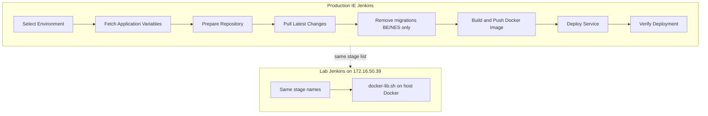
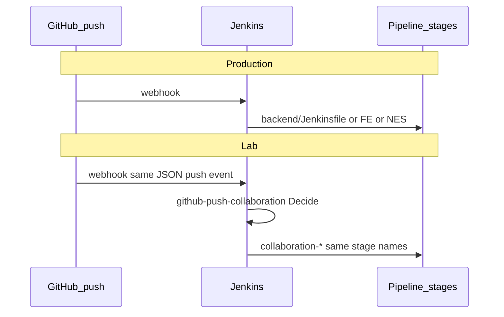

# Lab server = same DevOps flow as production (without touching company Jenkins)

Company **production** pipelines live in each app repo (`backend/Jenkinsfile`, `frontend/Jenkinsfile`, `Notification-and-email-service/Jenkinsfile`) and run on **IE Jenkins** → SSH → **Docker Hub** → **Docker Swarm**.

Your **lab** (`172.16.50.39`) reuses the **same stage names and order** in `DevOps/jenkins/jobs/Jenkinsfile.collaboration-*`. Implementation is in `jenkins/lib/docker-lib.sh`. **Do not edit app-repo Jenkinsfiles for the lab.**

## One diagram



## Stage mapping (exact names)

| Stage (production & lab) | Production does | Lab does (`docker-lib.sh`) |
|--------------------------|-----------------|----------------------------|
| **Select Environment** | Branch → `REMOTE_SERVER_TEST/PROD`, secrets path, SSH key | Branch `develop` → host `172.16.50.39`, compose + local registry |
| **Fetch Application Variables** | SSH `grep` on `/home/ubuntu/secrets/…` | Print `REPO_URL`, `REPO_DIR`, `BRANCH_NAME`, `DOCKERHUB_REPO`* , `SERVICE_NAME` from git + `.env.docker` |
| **Prepare Repository** | SSH `chown`/`chmod` on remote `REPO_DIR` | Start registry (+ db/redis/es or nes db); verify source readable |
| **Pull Latest Changes** | SSH `git pull` / clone on remote | `git_pull_repo` on host checkout (webhook: `ACTION=update-from-github`) |
| **Remove existing migrations** | SSH `rm` in `src/app/migrations` (BE, NES) | Same paths on host source tree before build |
| **Build and Push Docker Image** | Remote `docker build` + push **Docker Hub** | `docker build` with **DevOps lab Dockerfile** → push **127.0.0.1:5001** |
| **Deploy Service** | `docker service update` / `stack deploy` | `docker compose up --force-recreate` |
| **Verify Deployment** | Swarm `UpdateStatus` | HTTP smoke (health / `/`) |

\* Lab logs still use the name `DOCKERHUB_REPO` in Fetch stage so console output matches production vocabulary; the value is `127.0.0.1:5001/collaboration-*`.

## Jobs ↔ app repos ↔ production file

| Lab Jenkins job | GitHub repo (develop) | Production Jenkinsfile |
|-----------------|----------------------|-------------------------|
| `collaboration-backend` | `selamnew-collaboration-backend` | `backend/Jenkinsfile` |
| `collaboration-frontend` | `selamnew-collaboration-fe` | `frontend/Jenkinsfile` |
| `collaboration-notification` | `notification-and-email-service` | `Notification-and-email-service/Jenkinsfile` |
| `github-push-collaboration` | Webhook router (lab only) | — |
| `apply-vault-env` | Vault → env files (lab) | Prod uses server secret files + FE Vault build-args |
| `sync-devops-control-plane` | DevOps repo sync (lab only) | — |

## GitHub webhooks — production and lab (same idea)

Both environments start deploys with a **GitHub `push` webhook** → **Jenkins**. The app-repo `Jenkinsfile` files do not define the webhook; it is configured in **GitHub → Settings → Webhooks** and in **Jenkins** (job trigger / multibranch / Generic Webhook Trigger).

| | **Production (company Jenkins)** | **Lab (`172.16.50.39`)** |
|---|----------------------------------|---------------------------|
| **Trigger** | Push to `develop` / `staging` / `production` | Push to **`develop`** only (router ignores other branches) |
| **GitHub payload** | `application/json`, event **push** | Same |
| **Jenkins entry** | Company Jenkins URL (per team setup — often one job per repo or multibranch) | **One URL** for all three app repos → **`github-push-collaboration`** |
| **Plugin / style** | Often GitHub plugin or GWT on company controller | **Generic Webhook Trigger** (`generic-webhook-trigger/invoke?token=…`) |
| **What runs next** | That repo’s **`Jenkinsfile`** pipeline (SSH → remote build) | Router picks repo → **`collaboration-backend` / `-frontend` / `-notification`** with `ACTION=update-from-github` → same **stage names** as production |
| **Second webhook (optional)** | DevOps / infra repo if you have one | **`sync-devops-control-plane`** (DevOps repo `main`) — separate token |

**Lab URLs (same path prod would use conceptually: “invoke Jenkins on push”):**

```text
# All three app repos (FE, BE, NES) — one webhook each, same URL:
http://172.16.50.39/generic-webhook-trigger/invoke?token=<collab-token>
# or via Tailscale funnel:
https://selamnewcollab.tail020266.ts.net/generic-webhook-trigger/invoke?token=<collab-token>

# DevOps control plane only:
.../invoke?token=<devops-token>   → sync-devops-control-plane
```

Token files on the lab server: `jenkins/secrets/github-webhook-collab-token.txt` (apps), `github-webhook-token.txt` (DevOps). Default app token unless rotated: `selamnew-collab-push`.



## GitHub → lab (same intent as “push develop deploys test”)

1. Push to **`develop`** on FE / BE / NES.
2. Webhook hits the **collab token URL** (nginx :80 or :8080).
3. Job **`github-push-collaboration`** → **`collaboration-*`** with `ACTION=update-from-github`.
4. Pipeline runs the **same stages** as production naming → image on local registry → compose → nginx URLs.

Manual practice (same stages, no webhook): Jenkins → job → **Build with Parameters** → `ACTION=update-from-github`.

## What the lab deliberately does **not** copy

| Production only | Why lab differs |
|-----------------|-----------------|
| SSH to remote server | Jenkins container uses host `docker.sock` |
| Docker Hub login | Local registry `127.0.0.1:5001` |
| Swarm stacks (`pep`, `staging`, …) | Single-host Compose |
| FE stages “Sync core-* from …” | Branch promotion between core repos — not used on lab |
| Editing company Jenkins jobs | **Never** — lab jobs live only under `DevOps/jenkins/jobs/` |

## After changing lab pipelines

On the server (or from laptop with VPN):

```bash
cd /home/ienetworks/workspace/tools/docker-devops
set -a; . jenkins/secrets/admin.env; set +a
bash jenkins/bin/sync-jobs.sh
```

Or push **DevOps** `main` → webhook → `sync-devops-control-plane`.

## Source of truth

| What | Where |
|------|--------|
| Lab pipeline definitions | `DevOps/jenkins/jobs/Jenkinsfile.collaboration-*` |
| Lab build/deploy logic | `DevOps/jenkins/lib/docker-lib.sh` |
| Production pipeline (read-only for lab design) | App repo `Jenkinsfile` |
| Full lab runbook | `DevOps/README.md` |
