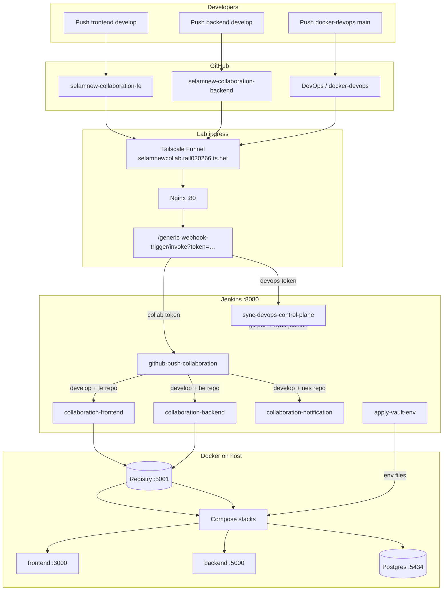
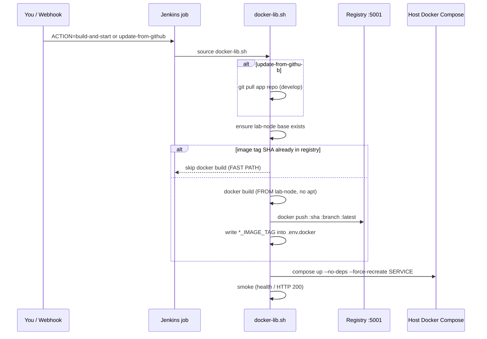
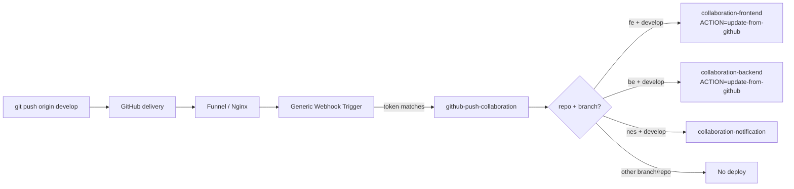
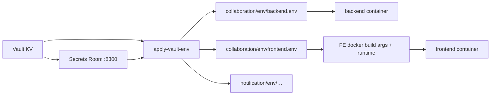

# Selamnew Collaboration — DevOps Lab (End-to-End)

This folder is the **control plane**. App source lives next to it; DevOps does **not** edit app repos.

| Piece | Path / repo | Edit here? |
|-------|-------------|------------|
| Control plane (this) | `docker-devops/` (or `/home/ienetworks/workspace/tools/docker-devops`) | **Yes** |
| Backend (Nest) | `…/SelamnewCollaboration/backend` → `IE-Network-Solutions/selamnew-collaboration-backend` | No |
| Frontend (Next) | `…/SelamnewCollaboration/frontend` → `IE-Network-Solutions/selamnew-collaboration-fe` | No |
| Notification (NES) | `…/Notification-and-email-service` | No |

**Lab host:** `172.16.50.39` (`ienetworks`)  
**Idea:** same pipeline *shape* as production Jenkinsfiles, but images go to a **local registry** and deploy with **Compose** on one VM (not Docker Hub + Swarm).

---

## Big picture



**Jenkins never runs Nest/Next itself.** It drives **host Docker** through `/var/run/docker.sock`, using scripts in `jenkins/lib/docker-lib.sh`.

---

## What you can open

| Service | URL | Notes |
|---------|-----|--------|
| Frontend | http://172.16.50.39:3000 | Next.js |
| Backend API | http://172.16.50.39:5000/api/v1/health | Nest |
| Notification | http://172.16.50.39:8006/api/v1/health | NES |
| Jenkins | http://172.16.50.39:8080 | `admin` / see `jenkins/secrets/admin.env` |
| Adminer (collab DB) | http://172.16.50.39:8083 | Server `db`, DB `selamnew-collab`, user `postgres` |
| Adminer (NES DB) | http://172.16.50.39:8084 | |
| Vault UI | http://172.16.50.39:8200/ui | |
| Secrets Room | http://172.16.50.39:8300 | Compare / apply Vault → env |
| Portainer | https://172.16.50.39:9443 | |
| Local registry | `127.0.0.1:5001` | On the server only |
| Public webhooks | `https://selamnewcollab.tail020266.ts.net/generic-webhook-trigger/invoke?token=…` | Funnel → Nginx → Jenkins |

Compose publishes (collaboration stack): FE `3000`, BE `5000`, Postgres `5434`, Redis `6381`, Adminer `8083`, ES `9200`.

---

## Folder map

```
docker-devops/
├── README.md                          ← this guide
├── collaboration/
│   ├── docker-compose.yml             FE/BE + db/redis/es/adminer
│   ├── docker/                        Lab Dockerfiles (lab-node base, FE/BE)
│   ├── .env.docker                    Compose ports + image tags
│   └── env/                           Runtime secrets (gitignored)
│       ├── backend.env
│       └── frontend.env               NEXT_PUBLIC_* also baked at image build
├── notification/                      NES compose + env
├── registry/                          Local Docker registry
├── jenkins/
│   ├── jobs/                          Pipeline source of truth (6 jobs)
│   ├── lib/docker-lib.sh              Build / push / deploy / smoke
│   ├── bin/sync-jobs.sh               Writes job XML into Jenkins
│   └── secrets/                       Tokens + admin.env (gitignored)
├── vault/  secrets-room/  nginx/  portainer/
└── scripts/
    ├── install-from-laptop.sh         rsync + bootstrap from your laptop
    ├── bootstrap-learning-server.sh   First-time server setup
    ├── build-images-on-host.sh        Fast image build (skip Jenkins timeout)
    ├── warm-lab-base.sh               One-time lab-node base (no apt in app builds)
    └── vault-*.sh                     Import / export secrets
```

---

## From scratch → running apps

### A. Laptop → server (recommended)

```bash
cd docker-devops
bash scripts/install-from-laptop.sh          # rsync control plane + bootstrap
# or clean slate:
bash scripts/install-from-laptop.sh --fresh
```

### B. On the server only

```bash
cd /home/ienetworks/workspace/tools/docker-devops
bash scripts/bootstrap-learning-server.sh
```

Bootstrap typically:

1. Ensures app clones under `COLLABORATION_SOURCE` (default `…/SelamnewCollaboration`)
2. Starts **registry**, **Jenkins**, **Vault**, infra (`db`, `redis`, `elasticsearch`, `adminer`)
3. Creates webhook token files under `jenkins/secrets/`
4. Registers the six Jenkins jobs via `jenkins/bin/sync-jobs.sh`

### C. First images + deploy

App containers need images in `127.0.0.1:5001`. Prefer a **one-time warm** then Jenkins (or host build).

```bash
# On server — build lab-node once (apt tools cached forever after this)
bash scripts/warm-lab-base.sh

# Option 1 — Jenkins UI (learn the stages)
#   http://172.16.50.39:8080
#   collaboration-backend  → Build with Parameters → ACTION=build-and-start
#   collaboration-frontend → Build with Parameters → ACTION=build-and-start
#   collaboration-notification (optional) → same

# Option 2 — faster on a slow network (host build, then Jenkins only recreates)
bash scripts/build-images-on-host.sh backend frontend
# Then Jenkins → each job → ACTION=recreate   (~30–60s)
```

### D. Verify access

```bash
curl -sf http://172.16.50.39:5000/api/v1/health
curl -sf -o /dev/null -w "%{http_code}\n" http://172.16.50.39:3000/
```

Open http://172.16.50.39:3000 and log in (org-emp + Firebase).  
Backend `NODE_ENV=production` **encrypts** API bodies; the FE image must be built with matching `NEXT_PUBLIC_ENCRYPTION_*` (see [Encryption](#encryption-frontend--backend)).

---

## How a build works (image → registry → Compose)



**Frontend bake-time:** `NEXT_PUBLIC_*` (Firebase, URLs, encryption, org-emp) are **build-args**. Changing them needs a **rebuild** (`FORCE_REBUILD=1` or new git SHA), not only `recreate`.

**Backend runtime:** most secrets come from `collaboration/env/backend.env` at container start.

---

## Jenkins jobs (what each one is for)

| Job | Who starts it | What it does |
|-----|---------------|--------------|
| `collaboration-backend` | You, or FE/BE router | Pull (optional) → build/push image → recreate `backend` → health |
| `collaboration-frontend` | You, or router | Same for Next → `:3000` |
| `collaboration-notification` | You, or router | Same for NES → `:8006` |
| `github-push-collaboration` | GitHub push webhook | **Router only** — decides which app job to start |
| `sync-devops-control-plane` | DevOps repo webhook / manual | `git pull` control plane + `sync-jobs.sh` (**does not** rebuild apps) |
| `apply-vault-env` | You / Secrets Room | Vault → `env/*.env` → recreate (or rebuild FE if public env changed) |

### `ACTION` parameter (app jobs)

| ACTION | `git pull`? | Build image? | Deploy? | Typical use |
|--------|-------------|--------------|---------|-------------|
| `start` | no | no | yes | Start stopped container |
| `stop` | no | no | stop | Stop one service |
| `restart` / `recreate` | no | no | recreate | Fast redeploy **existing** image tag |
| `build-and-start` | no | yes (local tree) | yes | First build / force from current tree |
| `update-from-github` | yes | yes | yes | What the **webhook** uses after push |

**Why Jenkins helps**

- One UI for build + deploy + logs (same stage story as production)
- Webhooks remove “SSH in and remember compose commands”
- Shared `docker-lib.sh` keeps FE/BE/NES behavior aligned
- Image skip-by-SHA keeps rebuilds short when commit did not change
- Control-plane sync updates pipelines without touching app repos

---

## Webhooks (how push becomes a deploy)

### Two tokens, two jobs

| Token file | Job | Purpose |
|------------|-----|---------|
| `jenkins/secrets/github-webhook-collab-token.txt` | `github-push-collaboration` | App repos (FE / BE / NES) |
| `jenkins/secrets/github-webhook-token.txt` | `sync-devops-control-plane` | This DevOps repo |

Default lab collab token (unless rotated): `selamnew-collab-push`.

**GitHub webhook URL (app repos):**

```text
https://selamnewcollab.tail020266.ts.net/generic-webhook-trigger/invoke?token=<collab-token>
```

(or `http://172.16.50.39:8080/generic-webhook-trigger/invoke?token=<collab-token>` on LAN)

- Content type: **application/json**
- Event: **push**
- Do **not** use `/github-webhook/` for this lab router

### App push flow (`develop` only)



Router behavior (important):

- Matches `repository.full_name` / `name` (case-insensitive)
- FE repo name: `selamnew-collaboration-fe`
- BE repo name: `selamnew-collaboration-backend`
- Only **`refs/heads/develop`**
- Starts downstream with **`wait: false`** so a long BE build does **not** block an FE webhook
- GWT config is written by `sync-jobs.sh` as `PipelineTriggersJobProperty` + injected `triggers { GenericTrigger(...) }` (GWT 2.4+; old `JobPropertyImpl` no longer exists)

### DevOps control-plane push

```text
push docker-devops → sync-devops-control-plane → git pull /var/devops → sync-jobs.sh
```

That **updates Jenkins job definitions**. It does **not** rebuild FE/BE images.

### After changing a Jenkinsfile on the server

```bash
cd /home/ienetworks/workspace/tools/docker-devops
# if edited on laptop: rsync / install-from-laptop, or git pull
export JENKINS_ADMIN_USER=admin JENKINS_ADMIN_PASS='…'   # from secrets/admin.env
bash jenkins/bin/sync-jobs.sh
```

---

## Secrets & Vault



- Runtime secrets: Vault → `apply-vault-env` → env files → recreate containers  
- **Never commit** `collaboration/env/*.env` or `jenkins/secrets/*`  
- FE public config must be present at **image build** time

---

## Encryption (frontend ↔ backend)

| Environment | Backend encrypts responses? | Frontend must decrypt? |
|-------------|----------------------------|-------------------------|
| Local `npm run dev` (`NODE_ENV=development`) | No | Usually `NEXT_PUBLIC_ENCRYPTION_DISABLED=true` |
| Lab / production images | **Yes** | **`NEXT_PUBLIC_ENCRYPTION_DISABLED=false`** + matching KEY/SALT/IV baked into the FE image |

Mismatch symptom: UI crashes like `(x ?? []) is not iterable` because the client treats `{ data: "<ciphertext>" }` as JSON arrays.

Rebuild FE after flipping encryption flags:

```bash
FORCE_REBUILD=1 ./scripts/build-images-on-host.sh frontend
# Jenkins → collaboration-frontend → ACTION=recreate
```

---

## Daily workflows (cheat sheet)

**Deploy my backend commit on `develop`**

1. Push to `selamnew-collaboration-backend` `develop`, **or**
2. Jenkins → `collaboration-backend` → `ACTION=update-from-github`

**Deploy frontend the same way** → `collaboration-frontend`.

**Only restart containers (image already good)**

- `ACTION=recreate` (fast)

**Change Compose / Dockerfile / Jenkinsfile in this repo**

1. Sync control plane to server (rsync or git)
2. `bash jenkins/bin/sync-jobs.sh` (or DevOps webhook)
3. Rebuild/recreate the affected service

**Change Vault secrets**

1. Edit in Vault / Secrets Room  
2. Run `apply-vault-env` (`TARGET=all|backend|frontend|notification`)

**Copy local DB into lab Adminer**

```bash
# example: pg_dump local → scp → pg_restore into collaboration-db-1
# Adminer: http://172.16.50.39:8083  server=db  db=selamnew-collab
```

After restoring `device_sessions` from another machine, truncate lab `device_sessions` or clients get “device signed out”.

---

## Fast path when builds feel slow

1. `bash scripts/warm-lab-base.sh` once  
2. Prefer `scripts/build-images-on-host.sh <service>` over Jenkins for heavy `npm`/`next build`  
3. Jenkins `ACTION=recreate` only  
4. Same git SHA already in registry → build stage **skips** automatically  
5. Env/Dockerfile-only FE changes: `FORCE_REBUILD=1` on host build

---

## Production vs lab

| Production (app Jenkinsfile) | This lab |
|------------------------------|----------|
| Secrets under `/home/ubuntu/secrets/` | `collaboration/env/*.env` + Vault |
| Push Docker Hub | `127.0.0.1:5001` |
| Swarm / remote SSH deploy | Compose on same host |
| Verify + email | Smoke curl + Jenkins console |

---

## Jenkins layout (inside this repo)

```
jenkins/
  docker-compose.yml     Jenkins controller
  Dockerfile             Image (docker CLI + compose plugin)
  plugins.txt            Includes generic-webhook-trigger
  jobs/                  Pipeline scripts (source of truth)
  lib/docker-lib.sh      Shared build / push / deploy / smoke
  bin/sync-jobs.sh       Posts job XML into Jenkins (+ GWT triggers)
  templates/             Job XML skeletons
  init.groovy.d/         First-boot admin user
  secrets/               admin.env + webhook tokens (gitignored)
```

Pipelines source `/var/devops/jenkins/lib/docker-lib.sh` inside the Jenkins container (`docker-devops` is mounted at `/var/devops`).

After editing any file under `jenkins/jobs/`, run `bash jenkins/bin/sync-jobs.sh` (or push this control-plane repo so `sync-devops-control-plane` does it). Do not hand-edit job config in the Jenkins UI if you want Git to stay source of truth.

---

## Rules

1. **Do not** change app-repo Jenkinsfiles/Dockerfiles for this lab — change `docker-devops/`.  
2. Apps run as **containers**, not `npm run dev` on the lab host.  
3. Secrets stay on the server / Vault — never in GitHub.  
4. Do not rotate webhook token files unless you update GitHub webhook URLs.  
5. Prefer `compose up --force-recreate <service>` over `compose down` (down drops DB unless volumes are careful).

---

## Troubleshooting

| Symptom | Check |
|---------|--------|
| Webhook GitHub **404** / “no GenericTrigger” | Run `jenkins/bin/sync-jobs.sh`; confirm GWT plugin; URL must be `/generic-webhook-trigger/invoke?token=…` |
| FE webhook **200** but no FE job | Old bug: router `wait:true` + `disableConcurrentBuilds` blocked behind BE — fixed; router should finish in seconds |
| Only `develop` should deploy | Other branches are ignored by design |
| `image not found` on deploy | Build once into registry (`build-and-start` or host script) |
| FE login `.map` / “not iterable” | Encryption mismatch or missing bake-time `NEXT_PUBLIC_*` — rebuild FE with encryption **enabled** for lab |
| Device signed out after DB copy | `TRUNCATE device_sessions;` on lab DB |
| Registry push connection refused | `docker compose -f registry/docker-compose.yml up -d` |
| Jenkins job XML stale | `sync-jobs.sh` after editing `jenkins/jobs/*` |

**Manual webhook test (on server):**

```bash
TOKEN=$(tr -d '[:space:]' < jenkins/secrets/github-webhook-collab-token.txt)
curl -sS -X POST -H 'Content-Type: application/json' \
  --data '{"ref":"refs/heads/develop","repository":{"full_name":"ie-network-solutions/selamnew-collaboration-fe","name":"selamnew-collaboration-fe"}}' \
  "http://127.0.0.1:8080/generic-webhook-trigger/invoke?token=${TOKEN}"
```

Expect `"triggered": true` and a new `collaboration-frontend` build.

---

## Jenkinsfile → job map

`jenkins/bin/sync-jobs.sh` reads these files and POSTs them into Jenkins:

| File under `jenkins/jobs/` | Jenkins job |
|----------------------------|-------------|
| `Jenkinsfile.collaboration-backend` | `collaboration-backend` |
| `Jenkinsfile.collaboration-frontend` | `collaboration-frontend` |
| `Jenkinsfile.collaboration-notification` | `collaboration-notification` |
| `Jenkinsfile.github-push-collaboration` | `github-push-collaboration` |
| `Jenkinsfile.sync-devops-control-plane` | `sync-devops-control-plane` |
| `Jenkinsfile.apply-vault-env` | `apply-vault-env` |

App jobs start with a **Why this job ran** stage (manual vs webhook).

This **README.md** is the single full guide for the lab — start here.
