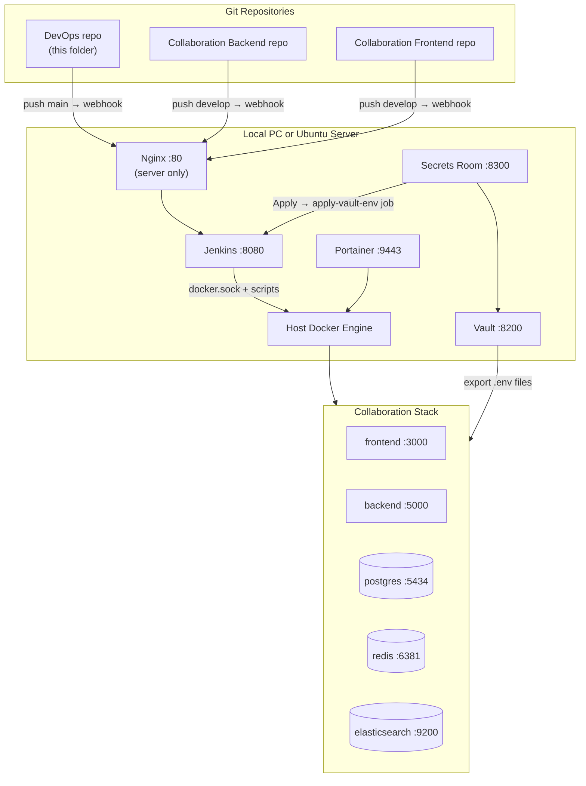
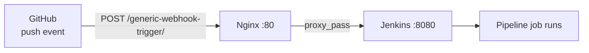
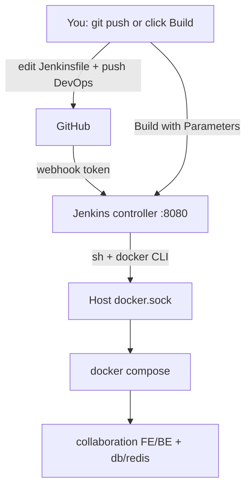
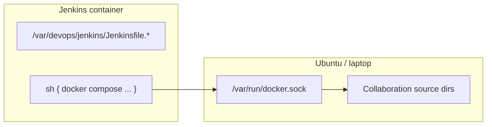
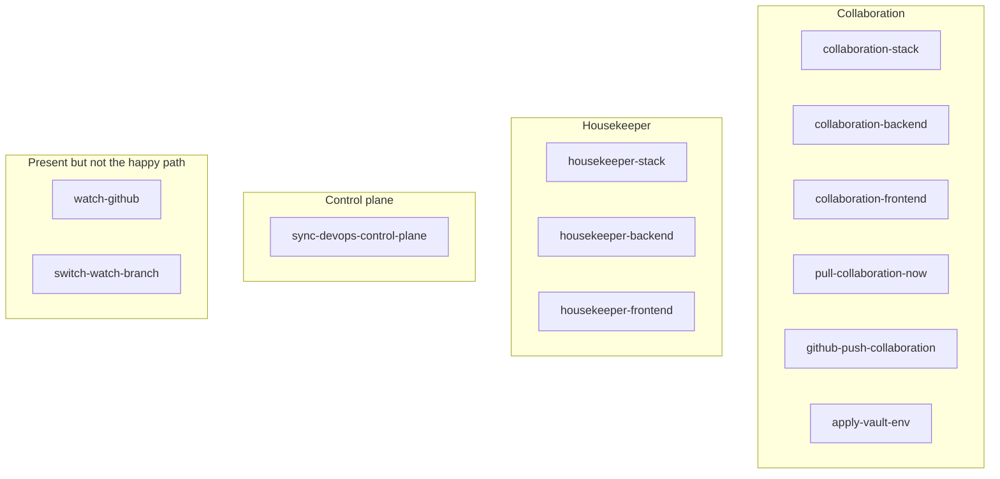

# DevOps Control Plane — End-to-End Guide

**GitHub:** https://github.com/mikias1219/DevOps

This folder is the **DevOps control plane** for running Selamnew Collaboration (and optionally Housekeeper) with Docker, Jenkins, Vault, and Nginx. It does **not** contain the app source code. App code lives in separate Git repositories; this repo holds everything needed to build, deploy, and manage those apps.

Read this document from top to bottom once. After that, use the [Quick Reference](#20-quick-reference-cheat-sheet) at the bottom for daily work.

**Part I (sections 1–20)** — platform, Docker, Nginx, Vault, server ops.  
**Part II (sections 21–34)** — Jenkins from zero: syntax, pipelines, hands-on labs.

---

## Table of Contents

### Part I — Platform and operations

1. [What problem does this solve?](#1-what-problem-does-this-solve)
2. [Big picture architecture](#2-big-picture-architecture)
3. [The three repositories (do not mix them)](#3-the-three-repositories-do-not-mix-them)
4. [Folder structure explained](#4-folder-structure-explained)
5. [Docker Compose projects](#5-docker-compose-projects)
6. [How services talk to each other](#6-how-services-talk-to-each-other)
7. [Ports and URLs](#7-ports-and-urls)
8. [Two environments: Local PC vs Ubuntu Server](#8-two-environments-local-pc-vs-ubuntu-server)
9. [First-time setup — Local PC](#9-first-time-setup--local-pc)
10. [Daily workflow — Local PC](#10-daily-workflow--local-pc)
11. [Jenkins — the remote control](#11-jenkins--the-remote-control)
12. [First-time setup — Ubuntu Server](#12-first-time-setup--ubuntu-server)
13. [Nginx — webhooks on the server](#13-nginx--webhooks-on-the-server)
14. [Vault and Secrets Room](#14-vault-and-secrets-room)
15. [Secrets and environment files](#15-secrets-and-environment-files)
16. [Deployment flows (step by step)](#16-deployment-flows-step-by-step)
17. [Scripts reference](#17-scripts-reference)
18. [Monitoring and troubleshooting](#18-monitoring-and-troubleshooting)
19. [What must never go to GitHub](#19-what-must-never-go-to-github)
20. [Quick reference cheat sheet](#20-quick-reference-cheat-sheet)

### Part II — Jenkins from zero

21. [Jenkins mental model](#21-jenkins-mental-model)
22. [Jenkins fundamentals](#22-jenkins-fundamentals)
23. [Jenkins folder map](#23-jenkins-folder-map)
24. [How Jenkins starts (compose mounts)](#24-how-jenkins-starts-compose-mounts)
25. [Jenkins end-to-end flows](#25-jenkins-end-to-end-flows)
26. [Pipeline syntax (the language)](#26-pipeline-syntax-the-language)
27. [Jenkins job catalog (detailed)](#27-jenkins-job-catalog-detailed)
28. [How a Jenkinsfile becomes a job](#28-how-a-jenkinsfile-becomes-a-job)
29. [Jenkins plugins](#29-jenkins-plugins)
30. [Jenkins hands-on learning path](#30-jenkins-hands-on-learning-path)
31. [Pipeline syntax pocket card](#31-pipeline-syntax-pocket-card)
32. [Jenkins traps and fixes](#32-jenkins-traps-and-fixes)
33. [What Jenkins is not](#33-what-jenkins-is-not)
34. [Jenkins files to read next](#34-jenkins-files-to-read-next)

---

## 1. What problem does this solve?

Without DevOps tooling, every developer would:

- Run `npm install` and `npm run dev` directly on their laptop
- Manually restart services after every Git pull
- Copy `.env` files by hand between machines
- Fight port conflicts between local apps and Docker

This control plane solves that by:

| Goal | How |
|------|-----|
| Consistent runtime | Apps run **only in Docker**, not on the host |
| Automated deploys | Jenkins pulls Git and recreates containers |
| Secret management | Vault + Secrets Room on the server |
| Visual management | Portainer for container logs/restarts |
| One place for ops config | Compose files, Jenkinsfiles, scripts live here |

**Golden rule:** Do not run `npm run dev` on the host for Collaboration. Do not install pgAdmin on the host — use Adminer in Docker.

---

## 2. Big picture architecture



**Key idea:** Jenkins is **not** an app server. It is a **remote control** that tells the host Docker engine to start, stop, pull code, and recreate containers. Jenkins itself runs in a container, but it controls the **host** Docker via `/var/run/docker.sock`.

---

## 3. The three repositories (do not mix them)

| Repo | GitHub | Disk path (example) | Contains |
|------|--------|---------------------|----------|
| **A) DevOps** (this repo) | https://github.com/mikias1219/DevOps | `/home/mikias/workspace/company/SelamnewCollaboration/docker-devops` | Compose, Jenkins, scripts, Vault config |
| **B) Collaboration Backend** | `IE-Network-Solutions/selamnew-collaboration-backend` | `.../SelamnewCollaboration/backend` | NestJS API source |
| **C) Collaboration Frontend** | `IE-Network-Solutions/selamnew-collaboration-fe` | `.../SelamnewCollaboration/frontend` | Next.js app source |

**Rules:**
- App code stays in B and C. Docker/Jenkins config stays in A.
- Never commit this control plane into the Collaboration app repos.
- Backend and frontend are **separate Git repos** — Jenkins pulls each independently.

---

## 4. Folder structure explained

```
docker-devops/
├── README.md                 ← You are here (everything in one guide)
│
├── collaboration/            ← Collaboration app stack
│   ├── docker-compose.yml    ← Defines FE, BE, DB, Redis, ES, Adminer
│   ├── .env.docker           ← Host paths, branches, ports (gitignored)
│   ├── .env.docker.example   ← Template to copy
│   ├── env/                  ← App secrets copied from backend/.env (gitignored)
│   │   ├── backend.env
│   │   └── frontend.env
│   └── docker/               ← Production Dockerfiles (optional build)
│
├── housekeeper/              ← Optional personal LifeOS stack
│   ├── docker-compose.yml
│   └── .env.docker
│
├── jenkins/                  ← CI/CD controller
│   ├── docker-compose.yml    ← Jenkins container + Docker socket mount
│   ├── Dockerfile            ← Jenkins LTS + Docker CLI + plugins
│   ├── Jenkinsfile.*         ← Pipeline definitions (source of truth)
│   ├── job-*.xml             ← Generated job configs (do not edit by hand)
│   ├── sync-jobs.sh          ← Push Jenkinsfiles → Jenkins REST API
│   ├── ensure-secrets.sh     ← Create admin.env + webhook tokens
│   ├── setup-jenkins.sh      ← First-time bootstrap
│   ├── trigger-build.sh      ← CLI job trigger
│   ├── docker-lib.sh         ← Shared git pull, npm install helpers
│   └── secrets/              ← Admin password, webhook tokens (gitignored)
│
├── vault/                    ← HashiCorp Vault (server secret store)
│   ├── docker-compose.yml
│   ├── config/vault.hcl
│   ├── secrets/              ← Unseal keys, root token (gitignored)
│   └── scripts/              ← bootstrap.sh, unseal.sh
│
├── secrets-room/             ← Web UI to manage Vault env vars
│   ├── docker-compose.yml
│   ├── server.js             ← Express app: compare keys, apply to containers
│   └── .env.example
│
├── portainer/                ← Visual Docker management UI
│   └── docker-compose.yml
│
├── nginx/
│   └── selamnew-vault-secrets.conf  ← Reverse proxy for GitHub webhooks (server)
│
└── scripts/                  ← Host-level start/stop/vault helpers
    ├── start-all.sh
    ├── stop-all.sh
    ├── start-collaboration.sh
    ├── sync-env-from-projects.sh
    ├── bootstrap-server-vault-room.sh
    └── vault-*.sh
```

---

## 5. Docker Compose projects

There are **six independent Compose projects**. Each creates its own Docker network. Services inside one project talk to each other by **service name** (e.g. `db`, `redis`).

### 5.1 Collaboration (`collaboration/docker-compose.yml`)

The main app stack. Uses **bind-mount dev mode** — source code on disk is mounted into containers, so a container recreate picks up new Git commits without rebuilding images.

| Service | Image | Host port | Role |
|---------|-------|-----------|------|
| `frontend` | node:20 | **3000** → container 3001 | Next.js dev server |
| `backend` | node:20 | **5000** | NestJS dev server |
| `db` | postgres:16 | **5434** | PostgreSQL database |
| `redis` | redis:7 | **6381** | Cache / sessions |
| `elasticsearch` | ES 8.13 | **9200** (localhost only) | Search |
| `adminer` | adminer:4 | **8083** | DB browser UI |

**How it starts:** `./scripts/start-collaboration.sh` reads `collaboration/.env.docker` for paths and ports, then runs `docker compose up -d`.

**Important:** `COLLABORATION_SOURCE` in `.env.docker` must point to the folder containing `backend/` and `frontend/` on disk. Jenkins and Compose bind-mount those folders into containers.

### 5.2 Jenkins (`jenkins/docker-compose.yml`)

| Service | Port | Role |
|---------|------|------|
| `jenkins` | **8080**, 50000 | CI/CD controller |

**Critical mounts:**
- `/var/run/docker.sock` — Jenkins controls **host** Docker (not Docker-in-Docker)
- `..:/var/devops:rw` — entire control plane visible inside Jenkins as `/var/devops`
- App source directories — so compose bind-mount paths resolve correctly
- `~/.ssh` → read-only — for `git fetch` over SSH from GitHub
- `jenkins/secrets` — admin credentials

**Note:** The `github-watch` polling sidecar is **currently disabled**. On your laptop, use manual Jenkins jobs to pull code. On the server, GitHub webhooks trigger deploys (see [Section 8](#8-two-environments-local-pc-vs-ubuntu-server)).

### 5.3 Vault (`vault/docker-compose.yml`) — server only

| Service | Port | Role |
|---------|------|------|
| `vault` | **8200** | Encrypted secret store with web UI |

Uses file storage (not `-dev` mode). Must be **unsealed** after every container restart.

### 5.4 Secrets Room (`secrets-room/docker-compose.yml`) — server only

| Service | Port | Role |
|---------|------|------|
| `secrets-room` | **8300** | Web UI to view/edit Vault secrets and apply them to running containers |

### 5.5 Portainer (`portainer/docker-compose.yml`)

| Service | Port | Role |
|---------|------|------|
| `portainer` | **9443** (HTTPS), 8000 | Visual Docker management |

Use Portainer to view logs, restart containers, and inspect resource usage without using the terminal.

### 5.6 Housekeeper (`housekeeper/docker-compose.yml`) — optional

Personal LifeOS project. Uses **built Docker images** (not bind-mount dev mode). Ports: web **3001**, API **4000**, Postgres **5433**, Redis **6380**.

---

## 6. How services talk to each other

### Inside the Collaboration network

```
Browser
  │
  ├─► http://localhost:3000 ──► frontend container (Next.js)
  │                                    │
  │                                    └─► calls http://localhost:5000 (host-mapped)
  │
  └─► http://localhost:5000 ──► backend container (NestJS)
                                       │
                                       ├─► db:5432        (PostgreSQL)
                                       ├─► redis:6379      (Redis)
                                       └─► elasticsearch:9200
```

Docker's internal DNS resolves service names (`db`, `redis`, `elasticsearch`) **only within the same Compose network**. That is why `collaboration/env/backend.env` uses `DB_HOST=db`, not `localhost`.

The frontend runs in the **browser**, so it calls the backend via `localhost:5000` (host port), not `backend:5000` (internal DNS).

### Jenkins → Host Docker → App containers

```
Jenkins container
  │
  ├─ mounts /var/run/docker.sock
  ├─ mounts /var/devops (this repo)
  │
  └─► runs: docker compose -f /var/devops/collaboration/docker-compose.yml up -d --force-recreate backend
        │
        └─► Host Docker Engine creates/recreates containers on the host
```

### Server: GitHub → Nginx → Jenkins → Docker

```
GitHub push event
  │
  └─► POST https://SERVER/generic-webhook-trigger/invoke?token=...
        │
        └─► Nginx :80 proxies to Jenkins :8080
              │
              └─► Jenkins job runs pipeline
                    │
                    └─► git pull + docker compose recreate
```

### Vault → Secrets Room → Jenkins → App containers

```
Operator edits secret in Secrets Room UI (:8300)
  │
  └─► "Apply" button
        │
        └─► Jenkins job: apply-vault-env
              │
              ├─► vault-export → writes collaboration/env/*.env
              └─► docker compose recreate backend + frontend
```

Apps **never call Vault at runtime**. They read flat `.env` files via Compose `env_file`. Vault is the **management** source; export writes those files.

---

## 7. Ports and URLs

| Port | Owner | URL |
|------|-------|-----|
| **3000** | Collaboration frontend | http://localhost:3000 |
| **3001** | Housekeeper web | http://localhost:3001 |
| **4000** | Housekeeper API | http://localhost:4000/api/v1 |
| **5000** | Collaboration backend | http://localhost:5000/api/v1 |
| **5433** | Housekeeper Postgres | — |
| **5434** | Collaboration Postgres | — |
| **6380** | Housekeeper Redis | — |
| **6381** | Collaboration Redis | — |
| **8080** | Jenkins | http://localhost:8080 |
| **8082** | Housekeeper Adminer | http://localhost:8082 |
| **8083** | Collaboration Adminer | http://localhost:8083 |
| **8200** | Vault UI (server) | http://SERVER:8200/ui |
| **8300** | Secrets Room (server) | http://SERVER:8300/ |
| **9200** | Elasticsearch | http://localhost:9200 |
| **9443** | Portainer | https://localhost:9443 |

**Port conflicts to avoid:**
- Do not run local Next.js **and** `collaboration-frontend-1` together (both want 3000)
- Do not run local NestJS **and** `collaboration-backend-1` together (both want 5000)

**Rule:** do not put two owners on the same port. Check live usage: `docker ps --format 'table {{.Names}}\t{{.Ports}}'`.

---

## 8. Two environments: Local PC vs Ubuntu Server

| | Local PC (your laptop) | Ubuntu Server (`172.16.50.39`) |
|--|------------------------|--------------------------------|
| **Purpose** | Development, learning DevOps | Production-like deploy target |
| **GitHub reachability** | GitHub **cannot** call `localhost:8080` | GitHub **can** reach server via LAN / Tailscale |
| **Deploy trigger** | Manual Jenkins jobs | GitHub webhooks via Nginx |
| **Secret storage** | Flat `.env` files copied locally | HashiCorp Vault + Secrets Room |
| **Auto-pull on push** | Run `pull-collaboration-now` job manually | Automatic via `github-push-collaboration` webhook |
| **DevOps repo sync** | `git pull` by hand + `sync-jobs.sh` | Webhook → `sync-devops-control-plane` job |

### Local PC deploy path

```
You push to GitHub develop
  │
  └─► (nothing automatic — GitHub cannot reach your PC)
        │
        └─► You manually trigger Jenkins:
              • Job: pull-collaboration-now
              • Or: ACTION=update-from-github ./jenkins/trigger-build.sh collaboration-backend
```

### Server deploy path

```
You push to GitHub develop
  │
  └─► GitHub sends webhook POST to https://SERVER/generic-webhook-trigger/invoke?token=...
        │
        └─► Nginx forwards to Jenkins :8080
              │
              └─► Job github-push-collaboration:
                    git pull backend + frontend → npm install → docker compose recreate
```

---

## 9. First-time setup — Local PC

**Prerequisites:**
- Docker Engine installed and running
- GitHub SSH key at `~/.ssh/id_ed25519` that can read the private app repos
- Backend and frontend already cloned on disk
- This DevOps repo cloned

**Steps:**

```bash
# 1. Go to the control plane
cd /home/mikias/workspace/company/SelamnewCollaboration/docker-devops

# 2. Make scripts executable
chmod +x scripts/*.sh jenkins/*.sh vault/scripts/*.sh

# 3. Create local config from examples
cp collaboration/.env.docker.example collaboration/.env.docker
# Edit .env.docker if your paths differ from the example

# 4. Copy app secrets into docker env folder (patches Docker hostnames)
./scripts/sync-env-from-projects.sh

# 5. Create Jenkins admin credentials and webhook token files
./jenkins/ensure-secrets.sh
# Edit jenkins/secrets/admin.env — set a strong JENKINS_ADMIN_PASS

# 6. Start Collaboration stack
./scripts/start-collaboration.sh

# 7. Start Jenkins
docker compose -f jenkins/docker-compose.yml up -d --build

# 8. Register all Jenkins jobs from Jenkinsfiles
./jenkins/sync-jobs.sh
```

**Verify:**

| Check | URL / command |
|-------|---------------|
| App UI | http://localhost:3000 |
| API health | http://localhost:5000/api/v1/spaces |
| Jenkins login | http://localhost:8080 (user/pass from `jenkins/secrets/admin.env`) |
| DB browser | http://localhost:8083 — System: PostgreSQL, Server: `db`, User: `postgres`, Password: `collab_secret`, DB: `selamnew-collab` |
| Containers running | `docker ps` |

---

## 10. Daily workflow — Local PC

### Start after reboot

```bash
cd /home/mikias/workspace/company/SelamnewCollaboration/docker-devops
./scripts/start-collaboration.sh
docker compose -f jenkins/docker-compose.yml up -d
```

### Stop (data volumes preserved)

```bash
./scripts/stop-collaboration.sh
docker compose -f jenkins/docker-compose.yml down
```

### Pick up a teammate's GitHub push

Since webhooks do not work locally, use one of these:

**Option A — Jenkins UI:**
1. Open http://localhost:8080
2. Job: `pull-collaboration-now` → Build with Parameters → TARGET = `both` (or `backend` / `frontend`)
3. Build

**Option B — Terminal:**

```bash
ACTION=update-from-github ./jenkins/trigger-build.sh collaboration-backend
ACTION=update-from-github ./jenkins/trigger-build.sh collaboration-frontend
```

**Option C — Full stack job:**

```bash
ACTION=update-from-github ./jenkins/trigger-build.sh collaboration-stack
```

### Switch which Git branch Jenkins watches

Do **not** edit `.env.docker` by hand. Use Jenkins job `switch-watch-branch`:

1. http://localhost:8080/job/switch-watch-branch/
2. Build with Parameters → REPO = `collaboration-backend` or `collaboration-frontend`
3. Jenkins lists live GitHub branches and pauses for you to pick one
4. Proceed → branch saved to `.env.docker`, code pulled, containers recreated

### Browse database tables

**Adminer (recommended):** http://localhost:8083

| Field | Value |
|-------|-------|
| System | PostgreSQL |
| Server | `db` |
| Username | `postgres` |
| Password | `collab_secret` |
| Database | `selamnew-collab` |

**SQL shell:**

```bash
docker exec -it collaboration-db-1 psql -U postgres -d selamnew-collab
```

---

## 11. Jenkins — the remote control

### What Jenkins does here

Jenkins **does not run your NestJS or Next.js apps inside the JVM**. It runs shell commands that:

1. `git fetch` + fast-forward the app source on disk
2. Run `npm install` inside an ephemeral `node:20` container (if needed)
3. Call `docker compose up -d --force-recreate` for the target service
4. Smoke-test the backend (`GET /api/v1/spaces`)

### How jobs are created

```
You edit Jenkinsfile.*  →  git push DevOps repo  →  sync-jobs.sh reads Jenkinsfiles
                                                          │
                                                          └─► POST config.xml to Jenkins REST API
```

On the server, pushing to DevOps `main` triggers `sync-devops-control-plane` automatically.

Locally, run `./jenkins/sync-jobs.sh` after any Jenkinsfile change.

### Job catalog

| Job | Trigger | What it does |
|-----|---------|--------------|
| `collaboration-stack` | Manual | Start/stop/restart/build entire Collaboration stack |
| `collaboration-backend` | Manual | Control backend (+ db/redis when starting) |
| `collaboration-frontend` | Manual | Control frontend |
| `pull-collaboration-now` | Manual | Pull backend and/or frontend from GitHub now |
| `github-push-collaboration` | **Webhook** (server) | Auto-deploy on app repo push |
| `sync-devops-control-plane` | **Webhook** (server) | Auto-sync Jenkinsfiles after DevOps repo push |
| `apply-vault-env` | Manual / Secrets Room | Export Vault secrets → recreate FE/BE |
| `switch-watch-branch` | Manual | Change watched Git branch |
| `housekeeper-*` | Manual | Same pattern for Housekeeper stack |

### ACTION parameter (manual jobs)

| ACTION | Effect |
|--------|--------|
| `start` | `docker compose up -d` for that service |
| `stop` | Stop that container |
| `restart` | Stop then start |
| `build-and-start` | Recreate container from current files on disk |
| `update-from-github` | `git pull` watched branch, then recreate |

**Example:**

```bash
ACTION=start ./jenkins/trigger-build.sh collaboration-backend
ACTION=stop ./jenkins/trigger-build.sh collaboration-frontend
ACTION=update-from-github ./jenkins/trigger-build.sh collaboration-stack
```

### Watched branches

Stored in `collaboration/.env.docker`:

```
COLLABORATION_BACKEND_BRANCH=develop
COLLABORATION_FRONTEND_BRANCH=develop
```

A push to any **other** branch is ignored until you switch with `switch-watch-branch`.

---

## 12. First-time setup — Ubuntu Server

Server IP example: `172.16.50.39`  
Server clone path: `~/workspace/tools/docker-devops` (bind-mounted as `/var/devops` inside Jenkins)

### Prerequisites on server

- Docker Engine installed
- Git + SSH key for private repos
- Nginx installed (for webhooks)
- This DevOps repo cloned
- Collaboration backend + frontend cloned at paths referenced in `.env.docker`

### Bootstrap everything (Vault + Secrets Room + Jenkins jobs)

```bash
cd ~/workspace/tools/docker-devops

# Create secrets, start Vault, import env, start Secrets Room, sync Jenkins jobs
./scripts/bootstrap-server-vault-room.sh
```

This script:
1. Creates `jenkins/secrets/admin.env` and webhook token files (if missing)
2. Starts Vault and runs `vault/scripts/bootstrap.sh` (init, enable KV, create policies)
3. Imports existing `collaboration/env/*.env` into Vault (if present)
4. Creates `secrets-room/.env` with Vault token and basic auth
5. Starts Secrets Room container
6. Runs `jenkins/sync-jobs.sh`

### Start all services

```bash
# Collaboration app
./scripts/start-collaboration.sh

# Jenkins
docker compose -f jenkins/docker-compose.yml up -d --build

# Vault (if not already up from bootstrap)
docker compose -f vault/docker-compose.yml up -d

# Secrets Room (if not already up from bootstrap)
docker compose -f secrets-room/docker-compose.yml up -d

# Portainer (optional)
docker compose -f portainer/docker-compose.yml up -d
```

### Configure GitHub webhooks

Two webhooks, one per repo. Tokens are in `jenkins/secrets/`.

**DevOps repo** (syncs Jenkinsfiles when you push control plane changes):

```
URL:    https://YOUR_SERVER/generic-webhook-trigger/invoke?token=<devops-token>
Events: Push to main
Token:  contents of jenkins/secrets/github-webhook-token.txt
Job:    sync-devops-control-plane
```

**Collaboration app repos** (backend + frontend — deploys app on push):

```
URL:    https://YOUR_SERVER/generic-webhook-trigger/invoke?token=selamnew-collab-push
Events: Push to develop (or your watched branch)
Token:  contents of jenkins/secrets/github-webhook-collab-token.txt
Job:    github-push-collaboration
```

Generate the devops token if needed:

```bash
./jenkins/ensure-secrets.sh
cat jenkins/secrets/github-webhook-token.txt
```

### Server URLs

| Service | URL |
|---------|-----|
| Collaboration app | http://SERVER:3000 |
| Collaboration API | http://SERVER:5000/api/v1 |
| Jenkins | http://SERVER:8080 |
| Vault UI | http://SERVER:8200/ui |
| Secrets Room | http://SERVER:8300/ |
| Portainer | https://SERVER:9443 |

---

## 13. Nginx — webhooks on the server

File: `nginx/selamnew-vault-secrets.conf`

**Purpose:** GitHub sends HTTP POST requests when you push code. Jenkins listens on port 8080, but GitHub needs a public-facing URL on port 80/443. Nginx sits in front and forwards webhook requests to Jenkins.



### What Nginx proxies

| Path | Forwards to | Used by |
|------|-------------|---------|
| `/generic-webhook-trigger/` | `127.0.0.1:8080` | Generic Webhook Trigger plugin (main path) |
| `/github-webhook/` | `127.0.0.1:8080` | Legacy GitHub plugin path |

**Vault and Secrets Room are NOT proxied through Nginx.** They are accessed directly on ports 8200 and 8300.

### Install on Ubuntu server

```bash
# Copy config into Nginx sites
sudo cp nginx/selamnew-vault-secrets.conf /etc/nginx/sites-available/selamnew-devops
sudo ln -sf /etc/nginx/sites-available/selamnew-devops /etc/nginx/sites-enabled/

# Test and reload
sudo nginx -t
sudo systemctl reload nginx
```

**If port 80 is already used** by the Collaboration app (e.g. production Nginx serving the frontend), do **not** enable this whole file. Instead, copy only the `location` blocks from `selamnew-vault-secrets.conf` into your existing `server { }` block.

### Test webhook reachability

```bash
# From another machine — should return Jenkins response (not connection refused)
curl -I "http://SERVER/generic-webhook-trigger/invoke?token=YOUR_TOKEN"
```

### External access options

GitHub must reach your server. Options:

- **LAN:** Server has a routable IP on your company network (`172.16.50.39`)
- **Tailscale Funnel:** Expose port 80 via Tailscale for GitHub webhooks
- **Reverse proxy with SSL:** Add Let's Encrypt in front of Nginx for HTTPS webhooks

---

## 14. Vault and Secrets Room

These run on the **server**, not typically on your laptop.

### Vault — encrypted secret store

```bash
# Start
docker compose -f vault/docker-compose.yml up -d

# First time only — init, enable KV, create policies
./vault/scripts/bootstrap.sh

# After container restart — Vault starts sealed
./vault/scripts/unseal.sh
```

**UI:** http://SERVER:8200/ui  
**Login:** root token from `vault/secrets/vault-keys.env` (never commit this file)

**KV paths:**

| Path | Contents |
|------|----------|
| `secret/collaboration/backend` | Backend env vars (Firebase, Stripe, DB, etc.) |
| `secret/collaboration/frontend` | Frontend env vars |
| `secret/collaboration/compose` | Compose-level settings |

### Secrets Room — friendly UI for operators

**URL:** http://SERVER:8300/  
**Login:** Basic auth from `secrets-room/.env` (`ROOM_BASIC_USER` / `ROOM_BASIC_PASS`)

What it does:
1. Reads keys from Vault
2. Compares them against `backend/.env.example` and `frontend/.env.example`
3. Shows **missing keys** highlighted in the UI
4. Lets you edit values
5. **Apply** button triggers Jenkins job `apply-vault-env` → exports to `collaboration/env/*.env` → recreates containers

### Vault workflow scripts

```bash
# Seed Vault from existing flat .env files (first import)
./scripts/vault-import-from-env.sh

# Export Vault → collaboration/env/*.env (without restarting containers)
./scripts/vault-export-collaboration-env.sh

# Export + recreate backend and frontend containers
./scripts/vault-apply-collaboration.sh

# Or trigger via Jenkins
ACTION=apply ./jenkins/trigger-build.sh apply-vault-env
```

---

## 15. Secrets and environment files

### Layers of configuration

| Layer | File | Git? | Purpose |
|-------|------|------|---------|
| Compose paths/ports | `collaboration/.env.docker` | No | Where source lives, which branch, host ports |
| App runtime secrets | `collaboration/env/backend.env`, `frontend.env` | No | Firebase, Stripe, API keys |
| Jenkins admin | `jenkins/secrets/admin.env` | No | Jenkins login |
| Webhook tokens | `jenkins/secrets/github-webhook-*.txt` | No | URL tokens for GitHub webhooks |
| Vault keys | `vault/secrets/vault-keys.env` | No | Unseal key + root token |
| Secrets Room | `secrets-room/.env` | No | Vault token, basic auth, Jenkins creds |

### Local workflow — copy from app repos

```bash
./scripts/sync-env-from-projects.sh
```

This copies `backend/.env` and `frontend/.env` into `collaboration/env/` and rewrites hostnames for Docker:

| Original (host) | Docker value |
|-----------------|--------------|
| `DB_HOST=localhost` | `DB_HOST=db` |
| `REDIS_HOST=localhost` | `REDIS_HOST=redis` |
| `ELASTICSEARCH_NODE=http://localhost:9200` | `ELASTICSEARCH_NODE=http://elasticsearch:9200` |

### Server workflow — Vault is source of truth

```
Edit in Vault UI or Secrets Room
  → Apply
  → vault-export-collaboration-env.sh writes collaboration/env/*.env
  → docker compose recreate backend + frontend
  → Apps read new values via env_file
```

---

## 16. Deployment flows (step by step)

### Flow A — You change app code (local PC)

```
1. You edit backend or frontend code locally
2. You commit and push to GitHub develop
3. GitHub cannot reach your PC → nothing automatic
4. You open Jenkins → pull-collaboration-now → TARGET=both → Build
5. Jenkins:
   a. git fetch + ff-only merge on disk (backend + frontend folders)
   b. npm install in node:20 container if node_modules changed
   c. docker compose up -d --force-recreate backend frontend
6. New code running at http://localhost:3000 and :5000
```

### Flow B — You change app code (server, automatic)

```
1. Teammate pushes to GitHub develop (backend or frontend repo)
2. GitHub POST → https://SERVER/generic-webhook-trigger/invoke?token=selamnew-collab-push
3. Nginx :80 → Jenkins :8080
4. Job github-push-collaboration starts
5. Pipeline checks gh_ref — ignores non-develop/main/master branches
6. git pull backend + frontend on server disk
7. npm install + docker compose recreate
8. App updated on server without anyone touching the server manually
```

### Flow C — You change DevOps config (Jenkinsfile, compose, scripts)

**Local:**

```bash
# Edit Jenkinsfile or compose locally
git add . && git commit -m "update pipeline" && git push origin main
# On server (or locally):
git pull
./jenkins/sync-jobs.sh
```

**Server (automatic after first webhook setup):**

```
1. You push DevOps repo to main
2. GitHub webhook → sync-devops-control-plane job
3. Job: git pull /var/devops (fails if server has local edits!)
4. Job: ./jenkins/sync-jobs.sh → updates all Jenkins jobs
5. New pipeline definitions active immediately
```

### Flow D — You change a secret (server)

```
1. Open Secrets Room http://SERVER:8300/
2. Edit key value (e.g. STRIPE_SECRET_KEY)
3. Click Apply
4. Jenkins apply-vault-env job runs:
   a. vault-export → collaboration/env/backend.env updated
   b. docker compose recreate backend (and frontend if needed)
5. Backend restarts with new secret — no manual file editing
```

---

## 17. Scripts reference

All scripts run from the control plane root unless noted.

### Lifecycle

| Script | What it does |
|--------|--------------|
| `./scripts/start-all.sh` | Portainer + Jenkins + Housekeeper + Collaboration |
| `./scripts/start-collaboration.sh` | Build (optional) + up Collaboration stack |
| `./scripts/start-housekeeper.sh` | Up Housekeeper stack |
| `./scripts/stop-all.sh` | Down all stacks (volumes kept) |
| `./scripts/stop-collaboration.sh` | Down Collaboration only |
| `./scripts/stop-housekeeper.sh` | Down Housekeeper only |

### Setup and maintenance

| Script | What it does |
|--------|--------------|
| `./scripts/sync-env-from-projects.sh` | Copy app `.env` → `collaboration/env/`, patch Docker hostnames |
| `./scripts/build-collaboration.sh` | Build production Docker images (slow; dev mode skips this) |
| `./scripts/cleanup-docker.sh` | Prune unused containers, images, build cache |
| `./scripts/remove-local-packages.sh` | Delete host `node_modules` (enforce Docker-only rule) |
| `./scripts/migrate-from-lifeos.sh` | Migration helper from old LifeOS setup |

### Vault / server

| Script | What it does |
|--------|--------------|
| `./scripts/bootstrap-server-vault-room.sh` | One-shot server bootstrap: secrets, Vault, import, Secrets Room, sync jobs |
| `./scripts/vault-import-from-env.sh` | Seed Vault from existing `.env` files |
| `./scripts/vault-export-collaboration-env.sh` | Vault KV → `collaboration/env/*.env` |
| `./scripts/vault-apply-collaboration.sh` | Export + recreate FE/BE |
| `./vault/scripts/bootstrap.sh` | Init Vault, enable KV, create policies |
| `./vault/scripts/unseal.sh` | Unseal Vault after restart |

### Jenkins

| Script | What it does |
|--------|--------------|
| `./jenkins/ensure-secrets.sh` | Create `admin.env` + webhook token files if missing |
| `./jenkins/setup-jenkins.sh` | Full first-time Jenkins bootstrap (admin user + sync jobs) |
| `./jenkins/sync-jobs.sh` | Register/update all pipeline jobs from Jenkinsfiles |
| `./jenkins/trigger-build.sh` | CLI: `ACTION=update-from-github ./jenkins/trigger-build.sh collaboration-backend` |

---

## 18. Monitoring and troubleshooting

### Check what is running

```bash
docker ps                                    # all containers
docker compose -f collaboration/docker-compose.yml ps
docker compose -f jenkins/docker-compose.yml ps
```

### View logs

```bash
docker logs collaboration-backend-1 --tail 100
docker logs collaboration-frontend-1 --tail 100
docker logs jenkins-jenkins-1 --tail 100
```

Or use **Portainer** (https://localhost:9443) → Containers → Logs.

### Common problems

| Symptom | Likely cause | Fix |
|---------|--------------|-----|
| Push happened but nothing deployed (local) | Webhooks don't work locally | Run `pull-collaboration-now` or `update-from-github` manually |
| Push happened but nothing deployed (server) | Wrong branch, bad token, Nginx down | Check Jenkins job console; verify webhook URL and token; `sudo nginx -t` |
| Port already in use | Host app running on same port | Stop host Next/Nest or change port in `.env.docker` |
| Jenkins can't run docker | Docker socket permission | Set `DOCKER_GID` in compose to match `stat -c '%g' /var/run/docker.sock` |
| `sync-devops-control-plane` fails | Server has local edits to DevOps repo | `git -C /var/devops status` — commit or stash local changes |
| Vault sealed | Container restarted | `./vault/scripts/unseal.sh` |
| Backend unhealthy | DB not ready or env missing | `docker logs collaboration-backend-1`; check `collaboration/env/backend.env` |
| SSH git fetch fails | Key not mounted or no repo access | Verify `~/.ssh/id_ed25519` works: `ssh -T git@github.com` |

### Healthchecks built into Compose

- Postgres: `pg_isready`
- Redis: `redis-cli ping`
- Backend: HTTP GET `/api/v1/spaces`
- Frontend: HTTP GET `/` status < 500
- Jenkins: HTTP GET `/login`

### Which branch is watched?

```bash
grep BRANCH collaboration/.env.docker
# Or Jenkins → switch-watch-branch (shows "Currently watching")
```

### Which branch is checked out on disk?

```bash
git -C /path/to/SelamnewCollaboration/backend branch --show-current
git -C /path/to/SelamnewCollaboration/frontend branch --show-current
```

---

## 19. What must never go to GitHub

These files are gitignored. If you commit them, secrets leak.

| File | Contains |
|------|----------|
| `collaboration/.env.docker` | Local paths and ports |
| `collaboration/env/backend.env` | Firebase, Stripe, DB passwords |
| `collaboration/env/frontend.env` | API keys, public config |
| `jenkins/secrets/admin.env` | Jenkins admin password |
| `jenkins/secrets/github-webhook-*.txt` | Webhook URL tokens |
| `vault/secrets/vault-keys.env` | Vault unseal key + root token |
| `vault/secrets/vault-approle.env` | CI auth credentials |
| `vault/secrets/operator-login.txt` | Vault UI username/password |
| `secrets-room/.env` | Vault token, room login |
| `.watch-state/` | Last-seen GitHub SHAs |

**Safe to commit:** Compose files, Jenkinsfiles, scripts, this README, `.example` files.

### Required secret files (server)

**Jenkins** (`jenkins/secrets/` — copy from `*.example`, then `chmod 600`):

| File | Purpose |
|------|---------|
| `admin.env` | `JENKINS_ADMIN_USER` / `JENKINS_ADMIN_PASS` |
| `github-webhook-token.txt` | Token for `sync-devops-control-plane` webhook |
| `github-webhook-collab-token.txt` | Token for `github-push-collaboration` webhook |
| `github-webhook-secret.txt` | Optional GitHub HMAC secret (documentation) |

Generate a webhook token: `openssl rand -hex 16`  
Bootstrap all Jenkins secret files: `./jenkins/ensure-secrets.sh`

**Vault** (`vault/secrets/` — created by `./vault/scripts/bootstrap.sh`, `chmod 700` dir, `chmod 600` files):

| File | Purpose |
|------|---------|
| `vault-keys.env` | Unseal key + root token |
| `vault-approle.env` | AppRole for export scripts |
| `operator-login.txt` | UI username/password |

---

## 20. Quick reference cheat sheet

### Start everything (local)

```bash
cd /home/mikias/workspace/company/SelamnewCollaboration/docker-devops
./scripts/start-collaboration.sh
docker compose -f jenkins/docker-compose.yml up -d
```

### Pull latest app code (local)

```bash
# Jenkins UI → pull-collaboration-now → TARGET=both
# Or:
ACTION=update-from-github ./jenkins/trigger-build.sh collaboration-stack
```

### Push DevOps changes to server

```bash
git push origin main
# Server webhook auto-runs sync-devops-control-plane
# Or manually on server: ./jenkins/sync-jobs.sh
```

### Change a secret on server

```
http://SERVER:8300/ → edit → Apply
```

### Key URLs (local)

| What | URL |
|------|-----|
| App | http://localhost:3000 |
| API | http://localhost:5000/api/v1 |
| Jenkins | http://localhost:8080 |
| DB UI | http://localhost:8083 |
| Portainer | https://localhost:9443 |

### Key URLs (server)

| What | URL |
|------|-----|
| App | http://172.16.50.39:3000 |
| Jenkins | http://172.16.50.39:8080 |
| Vault | http://172.16.50.39:8200/ui |
| Secrets Room | http://172.16.50.39:8300/ |

### Mental model

| You want to… | Do this |
|--------------|---------|
| Use the app | Containers up → http://localhost:3000 |
| Deploy app code (local) | Jenkins → `pull-collaboration-now` |
| Deploy app code (server) | Push to develop → webhook handles it |
| Update Jenkins pipelines | Push DevOps repo → `sync-jobs.sh` |
| Change env secrets (server) | Secrets Room → Apply |
| Restart one service | Jenkins job with ACTION=restart |
| See container logs | Portainer or `docker logs <container>` |
| Browse DB | http://localhost:8083 (Adminer) |
| Learn Jenkins syntax | [Part II — section 21+](#part-ii--jenkins-from-zero) |

---

# Part II — Jenkins from zero

A visual course that uses **this exact `jenkins/` directory**, not abstract Jenkins docs.

You learn three things together:

1. **What Jenkins is** (controller, jobs, agents, pipelines)
2. **The language** (Declarative Pipeline + Groovy + `sh` bash)
3. **How this project uses it** (Docker Compose on the host, GitHub webhooks, Vault)

Control plane repo: `https://github.com/mikias1219/DevOps`  
Jenkins folder on disk: `docker-devops/jenkins/` (bind-mounted into the container as `/var/devops/jenkins`)

Jenkins UI (laptop): http://127.0.0.1:8080  
Jenkins UI (server): http://172.16.50.39:8080

---

## 21. Jenkins mental model

Jenkins does **not** run your Nest/Next apps. It is a **remote control**. It talks to **host Docker** through `/var/run/docker.sock` and tells Compose to start / stop / recreate containers.



**Rule:** app source lives in Collaboration / Housekeeper repos. Docker + Jenkins live in DevOps. Do not commit this folder into Collaboration `develop`.

---

## 22. Jenkins fundamentals

### 22.1 What is Jenkins?

Jenkins is a **CI/CD server**:

| Word | Meaning here |
|------|----------------|
| **Controller** | The UI + job store. Your `jenkins` container. |
| **Agent** | Where steps run. This setup uses **the controller itself** (`agent any`) plus **host Docker**. |
| **Job / Item** | One named pipeline in the UI (`collaboration-backend`). |
| **Build** | One run of a job (`#7 SUCCESS`). |
| **Pipeline** | The script that defines stages (`Jenkinsfile.*`). |
| **Workspace** | Temp folder for that build inside Jenkins (`/var/jenkins_home/workspace/<job>`). |
| **Plugin** | Extra feature (Pipeline, Docker, Generic Webhook Trigger). |
| **Crumb / CSRF** | Token required for POST APIs (`crumbIssuer/api/json`). |
| **Sandbox** | Groovy runs in a sandbox (`<sandbox>true</sandbox>` in job XML). |

### 22.2 Two ways people write pipelines

| Style | Looks like | This repo |
|-------|------------|-----------|
| **Declarative** | `pipeline { agent any; stages { ... } }` | **All Jenkinsfiles** |
| **Scripted** | `node { stage('x') { } }` | Only small `script { }` blocks |

You only need **Declarative**. Groovy `script { }` is used when you need `if` on webhook `gh_ref`.

### 22.3 Freestyle vs Pipeline

Old Jenkins: click UI, add “Execute shell”.  
This project: **Pipeline-as-code**. The job XML is generated from a Jenkinsfile. Source of truth is Git, not the click UI.

```
Jenkinsfile  --sync-jobs.sh-->  job-*.xml  --HTTP POST-->  Jenkins config.xml
```

---

## 23. Jenkins folder map

```
jenkins/
├── docker-compose.yml                    ← run Jenkins
├── Dockerfile                           ← LTS + docker CLI + plugins
├── plugins.txt                          ← plugin list
├── init.groovy.d/reset-admin.groovy      ← first-boot admin user
├── secrets/                             ← gitignored real passwords/tokens
│   ├── admin.env.example
│   └── github-webhook-token.example
├── ensure-secrets.sh                   ← create admin.env + webhook tokens
├── setup-jenkins.sh                   ← first-time local bootstrap
├── sync-jobs.sh                        ← push Jenkinsfiles into Jenkins
├── trigger-build.sh                   ← curl Build with Parameters
├── docker-lib.sh                       ← git pull, npm, docker helpers
├── ci-lib.sh                           ← resolve host path of /var/devops
├── github-known_hosts                   ← GitHub SSH host keys
│
├── job-pipeline.xml.tpl                ← XML skeleton (ACTION parameter)
├── job-watch.xml.tpl                   ← XML skeleton (no params)
├── job-switch-watch.xml.tpl
├── job-*.xml                           ← GENERATED. Do not edit by hand.
│
├── Jenkinsfile.collaboration-stack
├── Jenkinsfile.collaboration-backend
├── Jenkinsfile.collaboration-frontend
├── Jenkinsfile.housekeeper-stack
├── Jenkinsfile.housekeeper-backend
├── Jenkinsfile.housekeeper-frontend
├── Jenkinsfile.pull-collaboration-now
├── Jenkinsfile.apply-vault-env
├── Jenkinsfile.sync-devops-control-plane
├── Jenkinsfile.github-push-collaboration
├── Jenkinsfile.watch-github            ← poller (currently unused)
├── Jenkinsfile.switch-watch-branch
└── watch-github-loop.sh                 ← poller sidecar (disabled)
```

| File | Role |
|------|------|
| `Dockerfile` | Image = `jenkins/jenkins:lts-jdk21` + docker CLI + compose plugin |
| `docker-compose.yml` | Port 8080, mount docker.sock, mount `..` as `/var/devops` |
| `plugins.txt` | Pipeline, Git, Docker, Blue Ocean, **generic-webhook-trigger** |
| `sync-jobs.sh` | Reads each Jenkinsfile, fills XML, POSTs to Jenkins REST |
| `docker-lib.sh` | `git_pull_repo`, `ensure_npm_packages` |
| `Jenkinsfile.*` | What you actually learn / edit |

---

## 24. How Jenkins starts (compose mounts)

Key mounts in `jenkins/docker-compose.yml`:

| Mount | Why |
|-------|-----|
| `jenkins_home` volume | Job history, plugins, users survive recreate |
| `/var/run/docker.sock` | Jenkins can run `docker` / `docker compose` on the **host** |
| `..:/var/devops` | Jenkinsfiles and scripts visible at `/var/devops/jenkins` |
| `init.groovy.d` | Runs Groovy on first start (admin user) |
| `secrets` | `admin.env` for API + job sync |

**Path trap (most important ops fact):**

- Inside Jenkins: `/var/devops/...`
- On the host: `/home/.../docker-devops/...`
- `docker run -v PATH:...` uses the **host** PATH.

That is why `Jenkinsfile.sync-devops-control-plane` sets `DEVOPS_HOST_PATH` and why `ci-lib.sh` exists.



---

## 25. Jenkins end-to-end flows

### 25.1 You click Build (manual)

```
Browser → job pull-collaboration-now → parameter TARGET=both
       → git pull backend+frontend
       → docker compose up -d --force-recreate backend frontend
```

### 25.2 GitHub push to Collaboration (webhook)

```
GitHub push develop
  → https://.../generic-webhook-trigger/invoke?token=<collab-token>
  → job github-push-collaboration
  → env.gh_ref = refs/heads/develop   (JSONPath $.ref)
  → git pull + recreate FE/BE
```

**Never name the webhook variable `ref`.** The Jenkins image already has env `REF`. This repo uses `gh_ref`.

### 25.3 GitHub push to DevOps (control plane)

```
You edit Jenkinsfile on laptop → git push mikias1219/DevOps main
  → webhook token → job sync-devops-control-plane
  → git pull /var/devops
  → sync-jobs.sh (python container — Jenkins image has no python3)
  → jobs in UI now match Git
```

Normal path is **git push**, not scp of Jenkinsfiles.

### 25.4 Vault → running apps

```
Secrets Room UI or job apply-vault-env
  → vault kv get secret/collaboration/{backend,frontend}
  → write collaboration/env/*.env
  → docker compose up -d --force-recreate backend frontend
```

Apps still read `process.env`. They do not call Vault at runtime.

---

## 26. Pipeline syntax (the language)

This is **Declarative Pipeline**. Groovy DSL compiled by plugin `workflow-cps`.

### 26.1 Skeleton (memorize this)

```groovy
pipeline {
  agent any                 // where to run (here: the Jenkins container)

  options { }               // timestamps, discard old builds, no overlap
  parameters { }            // UI dropdowns (TARGET, ACTION)
  environment { }           // env vars for every stage
  triggers { }              // cron / pollSCM (we use webhook plugin instead)

  stages {
    stage('Name shown in UI') {
      when { }              // skip this stage?
      steps {
        sh '...'            // bash
        echo '...'          // Groovy log line
        script { }          // extra Groovy
      }
    }
  }

  post {
    always { }
    success { }
    failure { }
  }
}
```

### 26.2 `agent`

| Syntax | Meaning |
|--------|---------|
| `agent any` | Run on any available executor (this box: the controller) |
| `agent none` | Decide per-stage |
| `agent { docker 'node:20' }` | Not used here — we call `docker run` from `sh` instead |

### 26.3 `options` (from this repo)

```groovy
options {
  timestamps()                          // [2026-08-21T13:59:50Z] in console
  disableConcurrentBuilds()             // one build of this job at a time
  buildDiscarder(logRotator(numToKeepStr: '30'))
}
```

| Option | Why |
|--------|-----|
| `timestamps()` | Plugin `timestamper` — match logs to clock |
| `disableConcurrentBuilds()` | Two webhooks will not fight over `git pull` |
| `buildDiscarder` | Keep last N consoles (disk) |

### 26.4 `parameters` vs job XML

Two ways this repo injects parameters:

**A. Declared in Jenkinsfile** (apply / pull):

```groovy
parameters {
  choice(
    name: 'TARGET',
    choices: ['both', 'backend', 'frontend'],
    description: 'Which Collaboration repo(s) to pull'
  )
}
```

Inside `sh`, that becomes env `TARGET`.

**B. Injected by `sync-jobs.sh` into XML** (stack / backend / frontend):

`job-pipeline.xml.tpl` always adds **ACTION**:

`start` | `stop` | `restart` | `build-and-start` | `update-from-github`

Housekeeper also gets **SKIP_TESTS** boolean.

In the shell you still write `${ACTION}` — Jenkins exports parameters as environment variables.

### 26.5 `environment`

```groovy
environment {
  COMPOSE_FILE = '/var/devops/collaboration/docker-compose.yml'
  ENV_FILE     = '/var/devops/collaboration/.env.docker'
  SERVICE      = 'backend'
}
```

These are **Groovy strings**, then exported to `sh`. They are not Docker Compose `.env` files.

### 26.6 `stages` / `stage` / `steps`

- **stages** — ordered list
- **stage('…')** — one column in the Stage View / Blue Ocean
- **steps** — must contain at least one step

Common steps:

| Step | Does |
|------|------|
| `sh 'cmd'` | Run shell (dash `/bin/sh` unless you shebang bash) |
| `echo 'msg'` | Print to Console Output |
| `script { groovy }` | If/else, set `env.FOO` |
| `error 'msg'` | Fail the build |
| `checkout scm` | Not used — we `git_pull_repo` bind-mounted dirs |

**Always shebang bash** in this repo because `set -euo pipefail` and arrays:

```groovy
sh '''#!/usr/bin/env bash
  set -euo pipefail
  . /var/devops/jenkins/docker-lib.sh
  git_pull_repo "$SOURCE/backend" "$BRANCH"
'''
```

Triple quotes `''' ... '''` = Groovy GString **without** interpolation. Use `"${VAR}"` inside bash, not Groovy `$`.

If you need Groovy to inject a value into the script, use `""" ... ${env.FOO} ... """` (double quotes). This repo mostly uses `'''` and relies on Jenkins-exported params.

### 26.7 `when`

Skip a stage without failing:

```groovy
stage('Pull and recreate') {
  when { expression { return env.SKIP_PULL != 'true' } }
  steps { ... }
}
```

Collaboration backend smoke test:

```groovy
when { expression { return params.ACTION != 'stop' } }
```

`params.ACTION` is the typed parameter; `env.ACTION` is the same value as a string.

### 26.8 `script` (Groovy)

Webhook jobs:

```groovy
script {
  def ref = env.gh_ref ?: ''
  if (ref && !(ref ==~ /refs\/heads\/(develop|main|master)/)) {
    env.SKIP_PULL = 'true'
  } else {
    env.SKIP_PULL = 'false'
  }
}
```

| Groovy | Meaning |
|--------|---------|
| `env.gh_ref` | Env var from Generic Webhook Trigger |
| `?: ''` | Default if null |
| `==~ /regex/` | Full-match regex |
| `env.SKIP_PULL = 'true'` | Visible to later `sh` and `when` |

### 26.9 `post`

```groovy
post {
  always  { echo 'Open Console Output' }   // success or fail
  success { echo 'Done' }
  failure { echo 'Fix git state; do not scp' }
}
```

Other: `unstable`, `aborted`, `changed`, `cleanup`.

### 26.10 `sh` vs Groovy — who runs what

```
pipeline {                  Groovy (Jenkins)
  stages {
    steps {
      sh '''                bash (inside agent OS)
        docker compose ...  host Docker via socket
      '''
    }
  }
}
```

Failures:

- Groovy syntax error → job **does not start**
- `sh` exit ≠ 0 → stage **red**, build FAILURE
- `set -euo pipefail` — undefined var (`u`) and pipe fail (`o`) also fail the stage

### 26.11 Environment variables cheat sheet

| Name | Source |
|------|--------|
| `ACTION` | Job parameter (stack jobs) |
| `TARGET` | Job parameter (pull / vault) |
| `SKIP_TESTS` | Boolean parameter (housekeeper) |
| `gh_ref` | Webhook JSON `$.ref` |
| `gh_after` | Commit SHA |
| `gh_repo` | `owner/name` |
| `COMPOSE_FILE` | `environment { }` in Jenkinsfile |
| `WORKSPACE` | Jenkins built-in |
| `BUILD_NUMBER` | Jenkins built-in |
| `JOB_NAME` | Jenkins built-in |

### 26.12 Shared helpers (`docker-lib.sh`)

Sourced from almost every `sh` block:

```bash
. /var/devops/jenkins/docker-lib.sh
```

| Function | What it does |
|---------|----------------|
| `git_pull_repo DIR BRANCH` | SSH fetch + ff-only merge |
| `to_github_ssh_url` | Convert https remote → `git@github.com:` |
| `install_npm_packages DIR` | `docker run node:20` npm install |
| `ensure_npm_packages` | Skip if `node_modules` exists |
| `env_file_get / env_file_set` | Read/write `.env.docker` keys |

GitHub SSH uses:

```
GIT_SSH_COMMAND=ssh -i /var/jenkins_home/.ssh-host/id_ed25519 \
  -o UserKnownHostsFile=/var/devops/jenkins/github-known_hosts
```

---

## 27. Jenkins job catalog (detailed)



| Job | Jenkinsfile | Trigger | Parameters | Does |
|-----|-------------|---------|------------|------|
| `collaboration-stack` | `Jenkinsfile.collaboration-stack` | Manual | ACTION | Full compose stack |
| `collaboration-backend` | `Jenkinsfile.collaboration-backend` | Manual | ACTION | BE + db/redis; smoke HTTP |
| `collaboration-frontend` | `Jenkinsfile.collaboration-frontend` | Manual | ACTION | FE only |
| `housekeeper-*` | `Jenkinsfile.housekeeper-*` | Manual | ACTION, SKIP_TESTS | Personal stack |
| `pull-collaboration-now` | `Jenkinsfile.pull-collaboration-now` | Manual | TARGET | Pull + recreate now |
| `apply-vault-env` | `Jenkinsfile.apply-vault-env` | Manual / Secrets Room | TARGET | Vault → env files + recreate |
| `sync-devops-control-plane` | `Jenkinsfile.sync-devops-control-plane` | DevOps webhook + manual | `gh_ref` | Pull DevOps git + `sync-jobs.sh` |
| `github-push-collaboration` | `Jenkinsfile.github-push-collaboration` | App webhook | `gh_ref` | Pull apps on push |
| `watch-github` | `Jenkinsfile.watch-github` | Disabled poller | — | Old SHA poller |
| `switch-watch-branch` | `Jenkinsfile.switch-watch-branch` | Manual | — | Change watched branch |

ACTION values (stack/service jobs):

| ACTION | Typical effect |
|-------|----------------|
| `start` | `compose up -d` (install npm if missing) |
| `stop` | `compose stop` that service |
| `restart` | stop then start |
| `build-and-start` | npm install + recreate |
| `update-from-github` | `git pull` then recreate |

---

## 28. How a Jenkinsfile becomes a job

```mermaid
sequenceDiagram
  participant File as Jenkinsfile.xyz
  participant Sync as sync-jobs.sh
  participant Tpl as job-pipeline.xml.tpl
  participant API as Jenkins REST
  participant UI as Job in UI

  File->>Sync: base64 script
  Tpl->>Sync: XML + ACTION param
  Sync->>Sync: escape &lt; &amp;
  Sync->>API: GET /job/xyz/api/json
  alt exists
    Sync->>API: POST /job/xyz/config.xml
  else new
    Sync->>API: POST /createItem?name=xyz
  end
  API->>UI: Pipeline job, sandbox on
```

Webhook jobs skip the ACTION template. `sync_gwt_job` writes Generic Webhook Trigger XML with token from `jenkins/secrets/*.txt`.

**CSRF:** every POST needs `Jenkins-Crumb` from `/crumbIssuer/api/json`.

CLI equivalent:

```bash
./jenkins/sync-jobs.sh
./jenkins/trigger-build.sh collaboration-backend update-from-github
```

---

## 29. Jenkins plugins

From `jenkins/plugins.txt`:

| Plugin | Why we have it |
|--------|----------------|
| `workflow-aggregator` | Pipeline (`pipeline { }`) |
| `workflow-cps` (via aggregator) | Groovy Jenkinsfile |
| `pipeline-stage-view` | Stage columns on job page |
| `git` / `github` | Git tooling |
| `credentials-binding` | `withCredentials` (available; jobs use files instead) |
| `timestamper` | `timestamps()` |
| `ws-cleanup` | Wipe workspace (available) |
| `docker-workflow` / `docker-plugin` | Docker steps (we mostly use CLI) |
| `blueocean` | Modern UI |
| `configuration-as-code` | JCasC (available) |
| `pipeline-utility-steps` | readJSON etc. |
| `generic-webhook-trigger` | GitHub → job without GitHub plugin hook |

Installed at **image build** (`jenkins-plugin-cli`). Changing `plugins.txt` requires rebuild:

```bash
docker compose -f jenkins/docker-compose.yml up -d --build
```

---

## 30. Jenkins hands-on learning path

Do these in order. Each maps to a file.

| # | Do this | You will learn | File |
|---|---------|----------------|------|
| 1 | Open http://127.0.0.1:8080 and log in | Controller UI | compose |
| 2 | Open `collaboration-backend` → Build with Parameters → `start` | Parameters + stages | `Jenkinsfile.collaboration-backend` |
| 3 | Open Console Output | `sh` logs, timestamps | — |
| 4 | Change an `echo` in a Jenkinsfile, run `./jenkins/sync-jobs.sh`, rebuild | Pipeline-as-code | `sync-jobs.sh` |
| 5 | Trace `ACTION` `case` in bash | Parameters as env | same Jenkinsfile |
| 6 | Read `when { expression }` smoke stage | Conditional stages | backend Jenkinsfile |
| 7 | Read `script { }` in github-push | Groovy + `gh_ref` | `Jenkinsfile.github-push-collaboration` |
| 8 | Read `post { }` in pull job | Success/fail hooks | `Jenkinsfile.pull-collaboration-now` |
| 9 | Read webhook XML in `sync-jobs.sh` (`sync_gwt_job`) | Triggers ≠ `triggers { }` | `sync-jobs.sh` |
| 10 | Read host-path `docker run` in sync-devops | Docker-from-Jenkins trap | `Jenkinsfile.sync-devops-control-plane` |

**Tiny practice pipeline** (paste into a new job → Pipeline script, sandbox on):

```groovy
pipeline {
  agent any
  parameters {
    string(name: 'WHO', defaultValue: 'Mikias', description: 'Your name')
  }
  stages {
    stage('Hello') {
      steps {
        echo "Hello ${params.WHO}"
        sh 'echo agent hostname=$(hostname) && docker version | head -2'
      }
    }
  }
  post {
    success { echo 'You ran a pipeline.' }
  }
}
```

Then compare it with `Jenkinsfile.pull-collaboration-now`.

---

## 31. Pipeline syntax pocket card

```
pipeline {                          // required root
  agent any                         // required (or agent none)
  options { timestamps() }
  parameters { choice(name: 'X', choices: ['a','b']) }
  environment { FOO = 'bar' }
  stages {                          // required
    stage('A') {
      when { expression { return true } }
      steps {
        echo 'groovy'
        sh '''#!/usr/bin/env bash
          set -euo pipefail
          echo "FOO=$FOO param X=$X"
        '''
        script { env.FLAG = '1' }
      }
    }
  }
  post { always { echo 'done' } }
}
```

**Quotes**

| Groovy quotes | Interpolates Groovy `$` | Use for |
|---------------|--------------------------|---------|
| `'single'` | no | fixed strings |
| `"double ${env.JOB_NAME}"` | yes | Groovy values |
| `'''heredoc'''` | no | bash scripts |
| `"""heredoc ${env.X}"""` | yes | bash + Groovy mix |

**Operators you will see**

| Groovy | |
|--------|--|
| `env.FOO ?: 'default'` | Elvis default |
| `!(x in ['a','b'])` | not in list |
| `==~ /regex/` | match entire string |
| `return true/false` | inside `when { expression }` |

---

## 32. Jenkins traps and fixes

| Symptom | Cause | Fix |
|--------|--------|-----|
| `python3: command not found` | LTS image has no Python | Run python in a sidecar container, or Node in secrets-room |
| `triggered: false` on webhook | Variable named `ref` clashes with image `REF` | Use `gh_ref` |
| `docker: command not found` (127) | Old image without CLI | Mount docker CLI / rebuild Dockerfile |
| `mkdir /home/ienetworks/... Permission denied` | `docker -v` host path from Jenkins user | Write via `/var/devops` bind-mount |
| Dirty tree fails `sync-devops-control-plane` | Local edits on server | Push from laptop; keep server clone clean |
| Webhook 200 but job skipped | `gh_ref` not develop/main | Filter in `script { }` is working as designed |

---

## 33. What Jenkins is not

- Not GitHub Actions
- Not Kubernetes
- Not building production images on every push (bind-mount + recreate)
- Not fetching Vault from Nest/Next at runtime
- DevOps git is **not** the app. App git is Collaboration FE/BE.

---

## 34. Jenkins files to read next

| File | When |
|------|------|
| `jenkins/Jenkinsfile.pull-collaboration-now` | Cleanest full example (params + bash + post) |
| `jenkins/Jenkinsfile.collaboration-backend` | ACTION + smoke `when` |
| `jenkins/Jenkinsfile.github-push-collaboration` | Webhook + Groovy `script` |
| `jenkins/Jenkinsfile.sync-devops-control-plane` | GitOps for Jenkins itself |
| `jenkins/sync-jobs.sh` | REST + XML + Generic Webhook Trigger |
| `jenkins/docker-lib.sh` | What `sh` actually calls |
| Official: [Declarative Pipeline](https://www.jenkins.io/doc/book/pipeline/syntax/) | Syntax reference |

---

*Last updated: August 2026. This README is the only documentation file — platform ops (Part I) and Jenkins course (Part II) are all here.*
