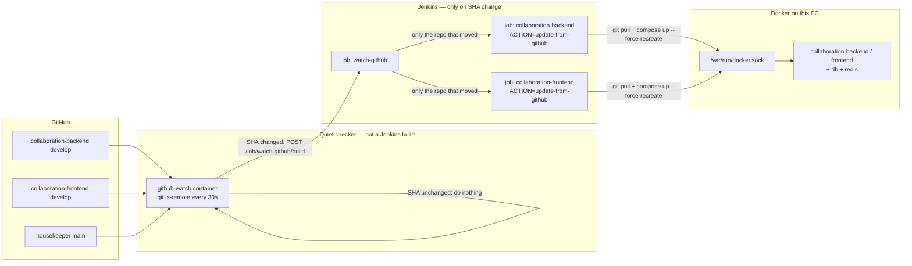

# Local DevOps — Docker + Jenkins + GitHub

GitHub: https://github.com/mikias1219/DevOps

This folder is the **control plane**. App source stays in the backend/frontend repos. Do not commit Docker/Jenkins config into Collaboration `develop`.

| What | Where |
|------|--------|
| Control plane (this repo) | https://github.com/mikias1219/DevOps — local clone `/home/mikias/workspace/tools/docker-devops/` |
| Collaboration source | `/home/mikias/workspace/company/SelamnewCollaboration` (separate GitHub repos) |
| Housekeeper source | `/home/mikias/workspace/personal/my personal project/lifeos` (separate repo) |

**Rule:** run apps in Docker. Do not `npm install` / `npm run dev` on the host. Do not install pgAdmin on the host — use the Docker Adminer UI (below) or `docker exec`.

---

## How the pieces talk (end to end)

Nothing rebuilds on a Jenkins timer. A quiet checker looks at GitHub. Jenkins only starts a job when a branch SHA actually changes. That job pulls the repo on disk and recreates the matching container.



### Step by step

1. **You (or a teammate) push** to GitHub `develop` (Collaboration) or `main` (Housekeeper).
2. **`github-watch`** (a small container next to Jenkins) runs `git ls-remote` over SSH about every 30 seconds. It compares the remote SHA to the last SHA saved in `.watch-state/`.
   - Same SHA → **no Jenkins build**, containers stay up.
   - New SHA → it POSTs Jenkins `watch-github` (CSRF crumb included).
3. **Jenkins job `watch-github`** runs **only then**. It checks each repo again and starts **only** the matching job:
   - `collaboration-backend` or `collaboration-frontend` (`develop`)
   - `housekeeper-backend` or `housekeeper-frontend` (`main`)
   - with `ACTION=update-from-github`
4. **That job** uses the host Docker socket (`/var/run/docker.sock`) to:
   - `git fetch` + fast-forward **the bind-mounted source** (the folders on disk)
   - `docker compose up -d --force-recreate` for that service
5. **The app container** starts again from the updated files. Collaboration backend/frontend bind-mount source, so a recreate picks up the new commit without a slow image build.

SSH to GitHub uses your key at `/home/mikias/.ssh/id_ed25519` (mounted read-only into Jenkins / github-watch). HTTPS remotes are converted to SSH for fetch.

**Jenkins UI:** http://localhost:8080/job/watch-github/  
If that job is idle, GitHub has not moved. That is expected.

---

## What runs locally

Four Compose projects. You can run Collaboration only (less RAM) or everything.

| Compose project | Containers | How the app runs |
|-----------------|------------|------------------|
| `collaboration` | `frontend`, `backend`, `db`, `redis` (ES optional) | Bind-mount source + `node:20`. Backend: `npm run start:dev` on **5000**. Frontend: `next dev --webpack` on container **3001**, host **3000**. |
| `housekeeper` | `web`, `api`, `postgres`, `redis` | Built images `housekeeper-web:local` / `housekeeper-api:local`. Web **3001**, API **4000**. |
| `jenkins` | `jenkins`, `github-watch` | Jenkins UI **8080**. `github-watch` has no UI; it only talks to Jenkins when GitHub changes. |
| `portainer` | `portainer` | Visual Docker UI **https://localhost:9443**. |

Jenkins does **not** run the apps inside the Jenkins JVM. It tells **host Docker** to start/stop/recreate the compose services.

### URLs

| Thing | URL |
|-------|-----|
| Collaboration app | http://localhost:3000 |
| Collaboration API | http://localhost:5000/api/v1 |
| Housekeeper app | http://localhost:3001 |
| Housekeeper API | http://localhost:4000/api/v1 |
| Jenkins | http://localhost:8080 |
| Portainer | https://localhost:9443 |
| Collaboration DB UI (Adminer) | http://localhost:8083 |

### Ports (no conflicts)

| | Housekeeper | Collaboration |
|--|-------------|---------------|
| Frontend | 3001 | 3000 |
| Backend | 4000 | 5000 |
| Postgres | 5433 | 5434 |
| Redis | 6380 | 6381 |
| Elasticsearch | — | 9200 (optional) |

Jenkins **8080** · Portainer **9443** · Housekeeper Adminer **8082** · Collaboration Adminer **8083**

---

## How to run each thing

Always from the control plane:

```bash
cd /home/mikias/workspace/tools/docker-devops
```

### Collaboration only (typical while learning)

```bash
./scripts/start-collaboration.sh
# Jenkins + GitHub watcher (needed for auto-rebuild)
docker compose -f jenkins/docker-compose.yml up -d
```

Then open http://localhost:3000 and http://localhost:8080.

### Everything (Housekeeper + Collaboration + Jenkins + Portainer)

```bash
./scripts/start-all.sh
./jenkins/sync-jobs.sh    # once, or after Jenkinsfile changes
```

### Stop (data volumes kept)

```bash
./scripts/stop-collaboration.sh
./scripts/stop-housekeeper.sh
./scripts/stop-all.sh
```

### Jenkins jobs (manual start/stop/rebuild)

http://localhost:8080 → job → **Build with Parameters** → **ACTION**:

| ACTION | What it does |
|--------|----------------|
| `start` | `docker compose up -d` for that service |
| `stop` | Stop that container |
| `restart` | Stop then start |
| `build-and-start` | Recreate the container from current source |
| `update-from-github` | `git pull` the watched branch, then recreate |

| Job | Controls |
|-----|----------|
| `collaboration-stack` | db + redis (+ ES if enabled) + backend + frontend |
| `collaboration-backend` | backend (+ db/redis when starting) |
| `collaboration-frontend` | frontend |
| `housekeeper-stack` | postgres + redis + api + web |
| `housekeeper-backend` | api (+ postgres/redis when starting) |
| `housekeeper-frontend` | web |
| `watch-github` | Rebuild **only** when the **watched** branch SHA changes |
| `switch-watch-branch` | Pick a GitHub branch, then watch + rebuild (no manual env edit) |

Manual pull + recreate without waiting for GitHub:

```bash
ACTION=update-from-github ./jenkins/trigger-build.sh collaboration-backend
ACTION=update-from-github ./jenkins/trigger-build.sh collaboration-frontend
```

Watched branches live in:

- `collaboration/.env.docker` → `COLLABORATION_*_BRANCH=develop`
- `housekeeper/.env.docker` → `HOUSEKEEPER_*_BRANCH=main`

### Switch the watched Git branch (Jenkins)

Do **not** edit `.env.docker` by hand. Use job **`switch-watch-branch`** before `watch-github`.

1. Open http://localhost:8080/job/switch-watch-branch/
2. **Build with Parameters**
3. **REPO** = `collaboration-backend`, `collaboration-frontend`, `collaboration-both`, or Housekeeper
4. **REBUILD_NOW** = checked (pull + recreate containers)
5. **Build** — the job lists live branches from GitHub
6. Jenkins pauses: **Paused for input** → pick **BRANCH** from the dropdown → **Proceed**

That job:

- writes the branch into `.env.docker`
- checks the branch out on disk
- resets the watcher SHA
- runs `update-from-github` if REBUILD_NOW is on

`github-watch` then follows the new branch automatically (it re-reads the env file every 30s). A push to `develop` will not rebuild until you switch back.

### Browse all tables (Docker Postgres UI)

The live database is Docker Postgres on host port **5434**, database **`selamnew-collab`**. The old host database `collab-db` (port 5432) was copied here and dropped.

**Option A — pgAdmin you already have (works immediately)**

Register a new server (do not use port 5432 anymore):

| Field | Value |
|-------|--------|
| Host | `127.0.0.1` |
| Port | `5434` |
| Username | `postgres` |
| Password | `collab_secret` |
| Database | `selamnew-collab` |

Then open **Databases → selamnew-collab → Schemas → public → Tables**.

**Option B — Adminer in Docker (no extra host install)**

Open **http://localhost:8081** (container `collaboration-adminer-1`):

| Field | Value |
|-------|--------|
| System | PostgreSQL |
| Server | `db` |
| Username | `postgres` |
| Password | `collab_secret` |
| Database | `selamnew-collab` |

Then: **public** → table → **Select data**.

If 8081 is not up yet: `cd /home/mikias/workspace/tools/docker-devops/collaboration && docker compose --env-file .env.docker up -d adminer`

**Housekeeper tables:** http://localhost:8082 — System PostgreSQL, server `postgres`, user `housekeeper`, password `housekeeper_secret`, database `housekeeper`.

**Option C — SQL shell**

```bash
docker exec -it collaboration-db-1 psql -U postgres -d selamnew-collab
```

### Portainer

https://localhost:9443 → Containers / Stacks.

- Start / stop / restart / logs
- Same Docker engine Jenkins uses

### First Collaboration login (platform owner)

Login uses **Firebase + Core Workspace** (org API), not the local DB password. After login, the app talks to local `:5000`.

If the tenant has no owner yet, initialize once (local backend must be up):

```bash
curl -X POST http://127.0.0.1:5000/api/v1/auth/workspace/initialize \
  -H 'Content-Type: application/json' \
  -d '{"tenantId":"<org-tenant-uuid>","userId":"<your-user-uuid>"}'
```

That seeds Owner/Admin/Member roles, assigns **Platform Owner**, and creates the default space.

---

## One-time setup (new machine)

```bash
cd /home/mikias/workspace/tools/docker-devops
chmod +x scripts/*.sh jenkins/*.sh jenkins/watch-github-loop.sh

./scripts/sync-env-from-projects.sh
./scripts/start-all.sh          # or start-collaboration.sh + Jenkins compose
./jenkins/sync-jobs.sh
```

Needs:

- Docker Engine running
- GitHub SSH key at `~/.ssh/id_ed25519` that can read the private repos
- Source checkouts already cloned (backend + frontend are **separate git repos** under Collaboration)

---

## Daily mental model

| You want… | Do this |
|-----------|---------|
| Use the Collaboration app | Containers up → http://localhost:3000 |
| Start / stop a service | Jenkins job ACTION, or Portainer |
| Pick up a GitHub `develop` push | Wait for `github-watch` → `watch-github` → recreate. Or run `update-from-github` yourself. |
| See why nothing rebuilt | `watch-github` idle = SHA unchanged. Checker logs: `docker logs jenkins-github-watch-1` |
| Inspect DB tables in a UI | http://localhost:8083 (Adminer) |
| Inspect DB in SQL | `docker exec -it collaboration-db-1 psql -U postgres -d selamnew-collab` |

---

## Scripts

```bash
./scripts/start-all.sh              # Portainer + Jenkins + both apps
./scripts/start-collaboration.sh    # Collaboration stack
./scripts/stop-all.sh               # stop all (data kept)
./scripts/stop-collaboration.sh
./scripts/stop-housekeeper.sh
./scripts/build-collaboration.sh    # optional production-style image build (slow)
./scripts/remove-local-packages.sh  # delete host node_modules
./scripts/sync-env-from-projects.sh # refresh docker env files from project .env
./scripts/cleanup-docker.sh         # prune unused Docker cache
./jenkins/sync-jobs.sh              # create/update Jenkins job XML
```
