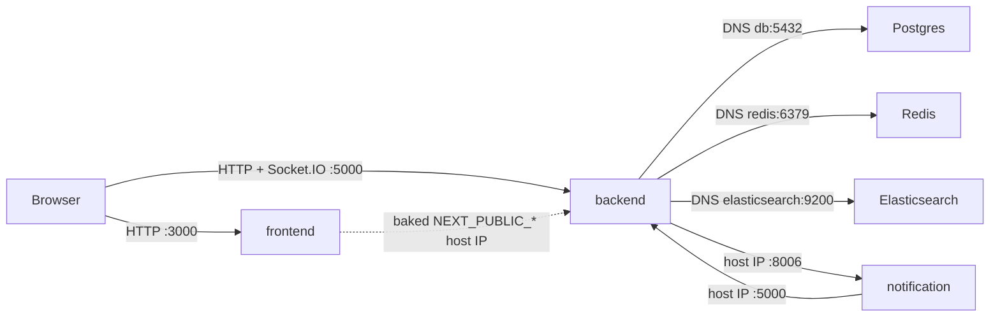
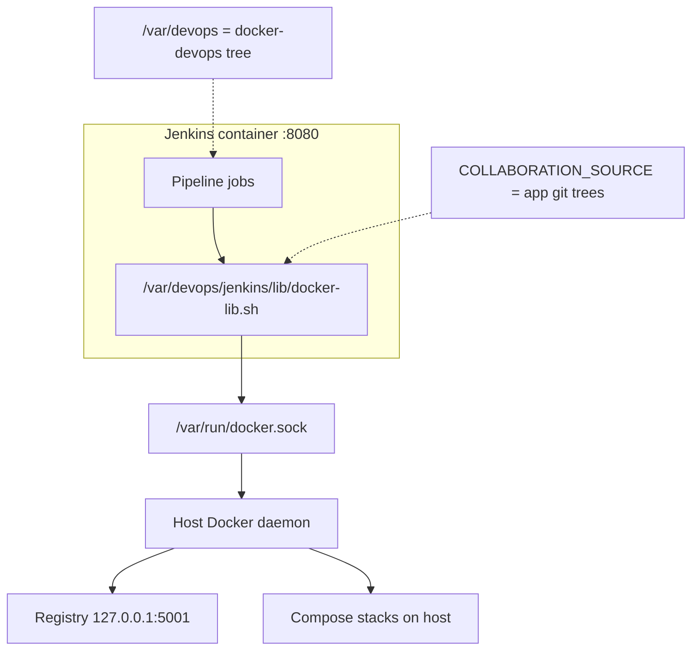
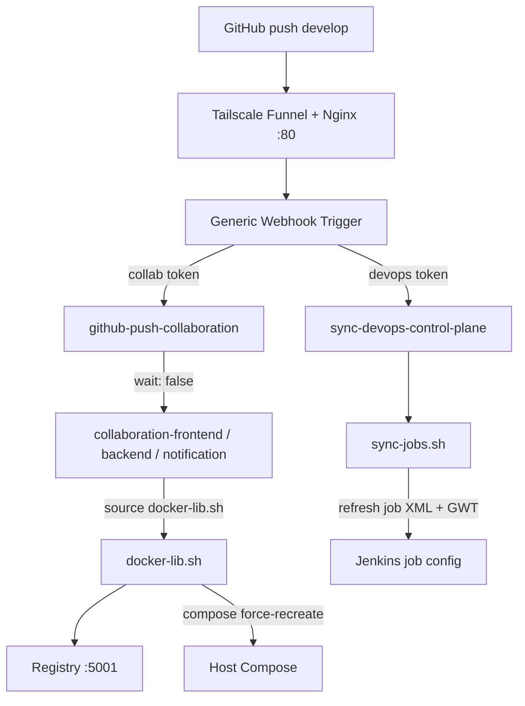
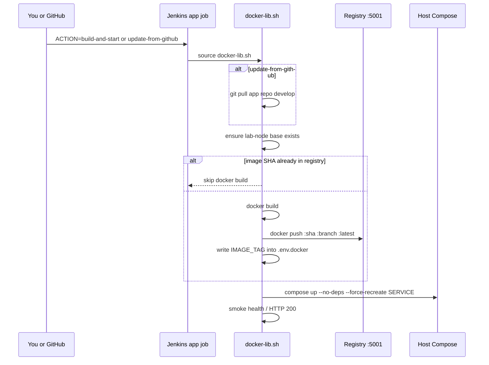
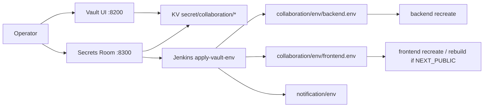

# Selamnew Collaboration — DevOps Lab

This folder is the **control plane**. App source lives next to it; DevOps does **not** edit app repos.

| Piece | Path / repo | Edit here? |
|-------|-------------|------------|
| Control plane (this) | `docker-devops/` (or `/home/ienetworks/workspace/tools/docker-devops`) | **Yes** |
| Backend (Nest) | `…/SelamnewCollaboration/backend` → `IE-Network-Solutions/selamnew-collaboration-backend` | No |
| Frontend (Next) | `…/SelamnewCollaboration/frontend` → `IE-Network-Solutions/selamnew-collaboration-fe` | No |
| Notification (NES) | `…/Notification-and-email-service` | No |

**Lab host:** `172.16.50.39` (`ienetworks`)  
**Idea:** same pipeline *shape* as production Jenkinsfiles, but images go to a **local registry** and deploy with **Compose** on one VM (not Docker Hub + Swarm).

Jenkins never runs Nest/Next itself. It drives **host Docker** through `/var/run/docker.sock`, using `jenkins/lib/docker-lib.sh`.

---

## What you can open

| Service | URL | Notes |
|---------|-----|--------|
| Frontend | http://172.16.50.39:3000 | Next.js |
| Backend API | http://172.16.50.39:5000/api/v1/health | Nest |
| Notification | http://172.16.50.39:8006/api/v1/health | NES (separate compose) |
| Jenkins | http://172.16.50.39:8080 | `admin` / see `jenkins/secrets/admin.env` |
| Adminer (collab DB) | http://172.16.50.39:8083 | Server `db`, DB `selamnew-collab`, user `postgres` |
| Adminer (NES DB) | http://172.16.50.39:8084 | Separate Postgres |
| Vault UI | http://172.16.50.39:8200/ui | |
| Secrets Room | http://172.16.50.39:8300 | Compare / apply Vault → env |
| Portainer | https://172.16.50.39:9443 | |
| Local registry | `127.0.0.1:5001` | On the server only |
| Public webhooks | `https://selamnewcollab.tail020266.ts.net/generic-webhook-trigger/invoke?token=…` | Funnel → Nginx → Jenkins |

Collaboration compose publishes: FE `3000`, BE `5000`, Postgres `5434`, Redis `6381`, Adminer `8083`, ES `9200`.

---

## How the running apps talk

Two kinds of addressing:

1. **Browser / cross-stack** → host IP `172.16.50.39` (the browser is outside Docker DNS).
2. **Inside collaboration Compose** → service names (`db`, `redis`, `elasticsearch`).



### Who talks to whom

| From | To | How | Typical URL / DNS |
|------|----|-----|-------------------|
| Browser | Frontend | HTTP | `http://172.16.50.39:3000` |
| Browser | Backend | REST + Socket.IO | `http://172.16.50.39:5000` path `/api/v1` (socket path `/api/v1/socket.io`) |
| Frontend container | Backend | Browser uses **baked** `NEXT_PUBLIC_*` host URLs (not Docker DNS) | `NEXT_PUBLIC_COLLABORATION_URL=http://172.16.50.39:5000/api/v1` |
| Backend | Postgres / Redis / ES | Compose DNS | `db:5432`, `redis:6379`, `http://elasticsearch:9200` |
| Backend | Notification | Host IP + bearer token | `NOTIFICATION_SERVICE_URL=http://172.16.50.39:8006/api/v1` |
| Notification | Backend | Host IP + bearer token | `COLLABORATION_SERVICE_URL=http://172.16.50.39:5000/api/v1` |
| You | Adminer | HTTP | `:8083` → connects to Compose service `db` |

### Ports (host → container)

| Service | Host port | Container |
|---------|-----------|-----------|
| frontend | `3000` | `3001` |
| backend | `5000` | `5000` |
| Postgres (collab) | `5434` | `5432` |
| Redis | `6381` | `6379` |
| Elasticsearch | `127.0.0.1:9200` | `9200` |
| Adminer (collab) | `8083` | `8080` |
| notification | `8006` | `8006` |
| Adminer (NES) | `8084` | `8080` |

NES is a **separate** Compose project (`notification/`). It does not share collab’s Postgres.

### Env vars that wire FE ↔ BE

Set in `collaboration/env/*.env` (and FE also **baked** at image build):

| Variable | Where | Lab value pattern |
|----------|--------|-------------------|
| `NEXT_PUBLIC_API_URL` / `NEXT_PUBLIC_COLLABORATION_URL` | frontend.env + FE build-args | `http://172.16.50.39:5000/api/v1` |
| `NEXT_PUBLIC_WS_URL` / `NEXT_PUBLIC_COLLABORATION_SOCKET_URL` | frontend.env | `http://172.16.50.39:5000` |
| `NEXT_PUBLIC_COLLABORATION_SOCKET_PATH` | frontend.env | `/api/v1/socket.io` |
| `NEXT_PUBLIC_APP_URL` | frontend.env | `http://172.16.50.39:3000` |
| `COLLABORATION_FRONT_URL` | backend.env + compose | `http://172.16.50.39:3000` |
| `APP_PUBLIC_BASE_URL` | backend.env + compose | `http://172.16.50.39:5000` |
| `DB_HOST` / `REDIS_HOST` / `ELASTICSEARCH_NODE` | compose overrides | `db` / `redis` / `http://elasticsearch:9200` |

`scripts/configure-lab-communication.sh` patches these to `${SERVER_IP:-172.16.50.39}` before Vault import.

---

## How Jenkins talks to the host

Jenkins is a container. It does **not** compile or run the apps inside its own filesystem for production traffic. It asks the **host Docker daemon** to build, push, and recreate app containers.



### Mounts that make that possible

From `jenkins/docker-compose.yml`:

| Mount | Why |
|-------|-----|
| `/var/run/docker.sock` | Build/push/compose on the **host** |
| `..:/var/devops` | Jenkinsfiles, compose files, `docker-lib.sh`, scripts |
| `COLLABORATION_SOURCE` → app tree | `git pull` + Docker build context for FE/BE/NES |
| `./secrets` → `/var/devops/jenkins/secrets` | Admin + webhook tokens |
| `group_add: DOCKER_GID` | Container user can use the socket |

Pipelines set `DEVOPS_ROOT=/var/devops` and source:

```bash
. /var/devops/jenkins/lib/docker-lib.sh
```

Shared helpers: `build_and_push_collaboration_*` → `docker push 127.0.0.1:5001/...` → `deploy_*_service` (`compose up --no-deps --force-recreate`) → smoke curl.

---

## How a push becomes a running container



### Sequence (app deploy)



**Frontend bake-time:** `NEXT_PUBLIC_*` are Docker **build-args**. Changing them needs a **rebuild** (`FORCE_REBUILD=1` or new git SHA), not only `recreate`.  
**Backend runtime:** most secrets come from `collaboration/env/backend.env` at container start.

---

## Jenkins jobs — who listens, who they talk to

| Job | Listens to | Talks to | Outcome |
|-----|------------|----------|---------|
| `github-push-collaboration` | GitHub collab webhook, **`develop` only** | Downstream app jobs with `wait: false` | Starts FE / BE / NES deploy without blocking |
| `collaboration-frontend` | Router or manual `ACTION` | `build_and_push_collaboration_frontend` → registry → `deploy_collaboration_service frontend` | FE on `:3000` |
| `collaboration-backend` | Router or manual `ACTION` | backend build/deploy + `ensure_collaboration_infra` | BE on `:5000` |
| `collaboration-notification` | Router or manual `ACTION` | NES build/deploy + notification infra | NES on `:8006` |
| `sync-devops-control-plane` | DevOps repo webhook | `git pull` control plane + `sync-jobs.sh` | Job XML / GWT refreshed; **no** app image rebuild |
| `apply-vault-env` | You / Secrets Room | Vault → `env/*.env` → recreate containers | Secrets live in running stacks |

### Router matching (`github-push-collaboration`)

| Repo name (case-insensitive) | Downstream job |
|------------------------------|----------------|
| `selamnew-collaboration-fe` | `collaboration-frontend` |
| `selamnew-collaboration-backend` | `collaboration-backend` |
| `notification-and-email-service` | `collaboration-notification` |

Only `refs/heads/develop`. Downstream uses `wait: false` so a long BE build does not block an FE webhook.

### `ACTION` parameter (app jobs)

| ACTION | `git pull`? | Build image? | Deploy? | Typical use |
|--------|-------------|--------------|---------|-------------|
| `start` | no | no | yes | Start stopped container |
| `stop` | no | no | stop | Stop one service |
| `restart` / `recreate` | no | no | recreate | Fast redeploy **existing** image tag |
| `build-and-start` | no | yes (local tree) | yes | First build / force from current tree |
| `update-from-github` | yes | yes | yes | What the **webhook** uses after push |

### Why Jenkins helps

- One UI for build + deploy + logs (same stage story as production)
- Webhooks remove “SSH in and remember compose commands”
- Shared `docker-lib.sh` keeps FE/BE/NES behavior aligned
- Image skip-by-SHA keeps rebuilds short when the commit did not change
- Control-plane sync updates pipelines without touching app repos

### Webhook tokens (two jobs, two tokens)

| Token file | Job |
|------------|-----|
| `jenkins/secrets/github-webhook-collab-token.txt` | `github-push-collaboration` |
| `jenkins/secrets/github-webhook-token.txt` | `sync-devops-control-plane` |

Default lab collab token (unless rotated): `selamnew-collab-push`.

**GitHub webhook URL (app repos):**

```text
https://selamnewcollab.tail020266.ts.net/generic-webhook-trigger/invoke?token=<collab-token>
```

(or `http://172.16.50.39:8080/generic-webhook-trigger/invoke?token=<collab-token>` on LAN)

- Content type: **application/json**
- Event: **push**
- Do **not** use `/github-webhook/` for this lab router

GWT config is written by `jenkins/bin/sync-jobs.sh` as `PipelineTriggersJobProperty` + injected `triggers { GenericTrigger(...) }` (GWT 2.4+).

After editing any file under `jenkins/jobs/`:

```bash
cd /home/ienetworks/workspace/tools/docker-devops
export JENKINS_ADMIN_USER=admin JENKINS_ADMIN_PASS='…'   # from secrets/admin.env
bash jenkins/bin/sync-jobs.sh
```

---

## Secrets & env management (Vault UI + Secrets Room)

Two UIs, one pipeline:

| UI | URL | Purpose |
|----|-----|---------|
| **Vault UI** | http://172.16.50.39:8200/ui | Edit KV secrets (`secret/collaboration/*`) |
| **Secrets Room** | http://172.16.50.39:8300/ | Compare Vault ↔ `env/*.env`, export, trigger **apply** |



### Logins (on the lab host)

```bash
# Vault UI (userpass)
cat /home/ienetworks/workspace/tools/docker-devops/vault/secrets/operator-login.txt

# Secrets Room (ROOM_BASIC_*)
grep '^ROOM_BASIC_' /home/ienetworks/workspace/tools/docker-devops/secrets-room/.env
```

Vault UI method: **Username** → user `operator` (policy `collaboration-admin`).  
Do **not** paste the root token into the browser unless you intend full admin.

### KV paths (what to edit in Vault)

| Path in UI | Disk file after apply |
|------------|------------------------|
| `secret/collaboration/backend` | `collaboration/env/backend.env` |
| `secret/collaboration/frontend` | `collaboration/env/frontend.env` |
| `secret/collaboration/compose` | `collaboration/.env.docker` |
| `secret/collaboration/notification` | `notification/env/notification.env` |

### Day-to-day workflow

1. **Change a secret** in Vault UI under `secret` → `collaboration` → `backend` / `frontend` / …
2. Open **Secrets Room** → Collaboration → pick Backend/Frontend → confirm Vault vs file (drift / synced).
3. Click **Apply** (or Jenkins → `apply-vault-env` → `TARGET=backend|frontend|notification|all`).
4. Job writes env files and **recreates** containers.  
   If you changed `NEXT_PUBLIC_*`, also **rebuild** the frontend image (`FORCE_REBUILD=1` or new SHA).

### Keep Vault / Room healthy

```bash
cd /home/ienetworks/workspace/tools/docker-devops
docker compose -f vault/docker-compose.yml up -d
./vault/scripts/unseal.sh                          # after every Vault restart
docker compose -f secrets-room/docker-compose.yml up -d

# Seed / refresh Vault from current env files
./scripts/vault-import-from-env.sh
```

- Runtime secrets: Vault → `apply-vault-env` → env files → recreate containers  
- **Never commit** `collaboration/env/*.env`, `vault/secrets/*`, or `jenkins/secrets/*`  
- FE public config must be present at **image build** time

---

## Encryption (frontend ↔ backend)

Browser **Web Crypto** (`crypto.subtle`) only works in a **secure context** (HTTPS or `localhost`).  
Lab UI is `http://172.16.50.39:3000` → encryption **must be off** on the FE.

| Environment | Backend encrypts? | Frontend setting |
|-------------|-------------------|------------------|
| Local `npm run dev` | No (`NODE_ENV=development`) | `NEXT_PUBLIC_ENCRYPTION_DISABLED=true` |
| Lab over **HTTP** IP | No — BE must run with `NODE_ENV=development` | **`NEXT_PUBLIC_ENCRYPTION_DISABLED=true`** |
| HTTPS / production | Yes | `NEXT_PUBLIC_ENCRYPTION_DISABLED=false` + matching KEY/SALT/IV |

**Lab gotcha:** `npm run start:prod` forces `NODE_ENV=production` (API body encryption) even if `backend.env` says `development`. Compose runs `command: ["node", "dist/main"]` so the env file wins. Otherwise BE encrypts, FE does not → `.reduce is not a function` / “not iterable”.

Mismatch symptoms:

- FE encrypt on, BE plain → `importKey` crash on HTTP, or weird payloads  
- FE encrypt off, BE encrypt on → ciphertext `{ data }` treated as a list

```bash
FORCE_REBUILD=1 ./scripts/build-images-on-host.sh frontend
# Jenkins → collaboration-frontend → ACTION=recreate
```

---

## Folder map

```
docker-devops/
├── README.md                          ← this guide
├── collaboration/
│   ├── docker-compose.yml             FE/BE + db/redis/es/adminer
│   ├── docker/                        Lab Dockerfiles (lab-node base, FE/BE)
│   ├── .env.docker                    Compose ports + image tags
│   └── env/                           Runtime secrets (gitignored)
│       ├── backend.env
│       └── frontend.env               NEXT_PUBLIC_* also baked at image build
├── notification/                      NES compose + env
├── registry/                          Local Docker registry
├── jenkins/
│   ├── jobs/                          Pipeline source of truth (6 jobs)
│   ├── lib/docker-lib.sh              Build / push / deploy / smoke
│   ├── bin/sync-jobs.sh               Writes job XML into Jenkins
│   └── secrets/                       Tokens + admin.env (gitignored)
├── vault/  secrets-room/  nginx/  portainer/
└── scripts/
    ├── install-from-laptop.sh         rsync + bootstrap from your laptop
    ├── bootstrap-learning-server.sh   First-time server setup
    ├── build-images-on-host.sh        Fast image build (skip Jenkins timeout)
    ├── warm-lab-base.sh               One-time lab-node base (no apt in app builds)
    ├── configure-lab-communication.sh Patch FE/BE/NES URLs to SERVER_IP
    └── vault-*.sh                     Import / export secrets
```

---

## From scratch → running apps

### A. Laptop → server (recommended)

```bash
cd docker-devops
bash scripts/install-from-laptop.sh          # rsync control plane + bootstrap
# or clean slate:
bash scripts/install-from-laptop.sh --fresh
```

### B. On the server only

```bash
cd /home/ienetworks/workspace/tools/docker-devops
bash scripts/bootstrap-learning-server.sh
```

Bootstrap typically:

1. Ensures app clones under `COLLABORATION_SOURCE` (default `…/SelamnewCollaboration`)
2. Starts **registry**, **Jenkins**, **Vault**, infra (`db`, `redis`, `elasticsearch`, `adminer`)
3. Creates webhook token files under `jenkins/secrets/`
4. Registers the six Jenkins jobs via `jenkins/bin/sync-jobs.sh`

### C. First images + deploy

```bash
bash scripts/warm-lab-base.sh

# Option 1 — Jenkins UI
#   collaboration-backend  → ACTION=build-and-start
#   collaboration-frontend → ACTION=build-and-start
#   collaboration-notification (optional)

# Option 2 — host build, then Jenkins only recreates
bash scripts/build-images-on-host.sh backend frontend
# Then Jenkins → each job → ACTION=recreate
```

### D. Verify

```bash
curl -sf http://172.16.50.39:5000/api/v1/health
curl -sf -o /dev/null -w "%{http_code}\n" http://172.16.50.39:3000/
```

Open http://172.16.50.39:3000 and log in. Lab FE/BE use **plain JSON** (see [Encryption](#encryption-frontend--backend)).

---

## Daily workflows

**Deploy my backend commit on `develop`**

1. Push to `selamnew-collaboration-backend` `develop`, **or**
2. Jenkins → `collaboration-backend` → `ACTION=update-from-github`

**Deploy frontend the same way** → `collaboration-frontend`.

**Only restart containers (image already good)** → `ACTION=recreate`.

**Change Compose / Dockerfile / Jenkinsfile in this repo**

1. Sync control plane to server (rsync or git)
2. `bash jenkins/bin/sync-jobs.sh` (or DevOps webhook)
3. Rebuild/recreate the affected service

**Change Vault secrets** → Secrets Room / Vault → `apply-vault-env` (`TARGET=all|backend|frontend|notification`).

**Copy local DB into lab** → `pg_dump` → restore into `collaboration-db-1` (Adminer `:8083`). After restore, `TRUNCATE device_sessions;` or clients get “device signed out”.

---

## Fast path when builds feel slow

1. `bash scripts/warm-lab-base.sh` once  
2. Prefer `scripts/build-images-on-host.sh <service>` for heavy `npm` / `next build`  
3. Jenkins `ACTION=recreate` only when the image tag is already good  
4. Same git SHA already in registry → build stage **skips** entirely  
5. Env/Dockerfile-only FE changes: `FORCE_REBUILD=1` on host build  

**Caching (enabled):** Jenkins builds use **BuildKit** with:

- `--cache-from <image>:latest` + inline cache metadata on push  
- Docker cache mounts for `/root/.npm` and (frontend) `/app/.next/cache`  

So unchanged `package-lock.json` reuses the deps layer, and incremental FE code changes reuse Next’s compile cache. First build after enabling cache is still full; the **second** build of the same app is the fast one.

`DOCKER_BUILDKIT=0` was the old lab default (slow, no mounts) — do not turn it back on.

---

## Production vs lab

| Production (app Jenkinsfile) | This lab |
|------------------------------|----------|
| Secrets under `/home/ubuntu/secrets/` | `collaboration/env/*.env` + Vault |
| Push Docker Hub | `127.0.0.1:5001` |
| Swarm / remote SSH deploy | Compose on same host |
| Verify + email | Smoke curl + Jenkins console |

---

## Jenkins layout (inside this repo)

```
jenkins/
  docker-compose.yml     Jenkins controller
  Dockerfile             Image (docker CLI + compose plugin)
  plugins.txt            Includes generic-webhook-trigger
  jobs/                  Pipeline scripts (source of truth)
  lib/docker-lib.sh      Shared build / push / deploy / smoke
  bin/sync-jobs.sh       Posts job XML into Jenkins (+ GWT triggers)
  templates/             Job XML skeletons
  init.groovy.d/         First-boot admin user
  secrets/               admin.env + webhook tokens (gitignored)
```

| File under `jenkins/jobs/` | Jenkins job |
|----------------------------|-------------|
| `Jenkinsfile.collaboration-backend` | `collaboration-backend` |
| `Jenkinsfile.collaboration-frontend` | `collaboration-frontend` |
| `Jenkinsfile.collaboration-notification` | `collaboration-notification` |
| `Jenkinsfile.github-push-collaboration` | `github-push-collaboration` |
| `Jenkinsfile.sync-devops-control-plane` | `sync-devops-control-plane` |
| `Jenkinsfile.apply-vault-env` | `apply-vault-env` |

Do not hand-edit job config in the Jenkins UI if you want Git to stay source of truth.

---

## Rules

1. **Do not** change app-repo Jenkinsfiles/Dockerfiles for this lab — change `docker-devops/`.  
2. Apps run as **containers**, not `npm run dev` on the lab host.  
3. Secrets stay on the server / Vault — never in GitHub.  
4. Do not rotate webhook token files unless you update GitHub webhook URLs.  
5. Prefer `compose up --force-recreate <service>` over `compose down` (down drops DB unless volumes are careful).

---

## Troubleshooting

| Symptom | Check |
|---------|--------|
| Webhook GitHub **404** / “no GenericTrigger” | Run `jenkins/bin/sync-jobs.sh`; URL must be `/generic-webhook-trigger/invoke?token=…` |
| FE webhook **200** but no FE job | Router must use `wait: false` so BE does not block FE |
| Only `develop` should deploy | Other branches ignored by design |
| `image not found` on deploy | Build once into registry (`build-and-start` or host script) |
| FE `.reduce` / “not iterable” / login crashes | Encryption mismatch — BE must be plain (`node dist/main` + `NODE_ENV=development`); FE `ENCRYPTION_DISABLED=true` |
| Device signed out after DB copy | `TRUNCATE device_sessions;` on lab DB |
| Vault UI down / sealed | `docker compose -f vault/docker-compose.yml up -d && ./vault/scripts/unseal.sh` |
| Secrets Room down | `docker compose -f secrets-room/docker-compose.yml up -d` |
| Vault “address already in use” crash loop | Compose must use `user: vault` + `entrypoint: ["vault"]` (not docker-entrypoint setcap) |
| Jenkins job XML stale | `sync-jobs.sh` after editing `jenkins/jobs/*` |

**Manual webhook test (on server):**

```bash
TOKEN=$(tr -d '[:space:]' < jenkins/secrets/github-webhook-collab-token.txt)
curl -sS -X POST -H 'Content-Type: application/json' \
  --data '{"ref":"refs/heads/develop","repository":{"full_name":"ie-network-solutions/selamnew-collaboration-fe","name":"selamnew-collaboration-fe"}}' \
  "http://127.0.0.1:8080/generic-webhook-trigger/invoke?token=${TOKEN}"
```

Expect `"triggered": true` and a new `collaboration-frontend` build.

---

This **README.md** is the single full guide for the lab — start here.
