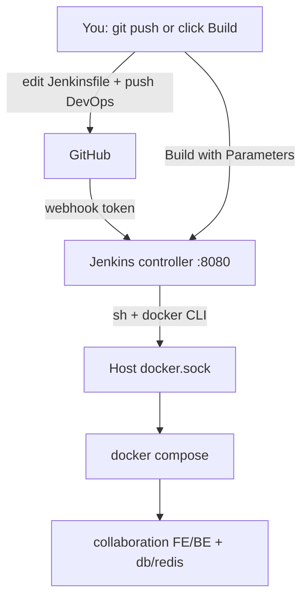
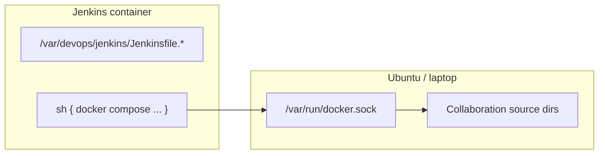
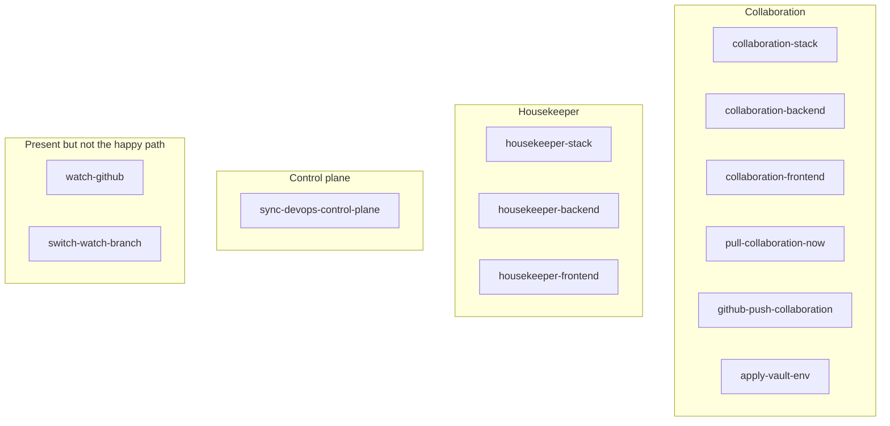

# Jenkins from zero — this DevOps folder

A visual course that uses **this exact `jenkins/` directory**, not abstract Jenkins docs.

You learn three things together:

1. **What Jenkins is** (controller, jobs, agents, pipelines)
2. **The language** (Declarative Pipeline + Groovy + `sh` bash)
3. **How this project uses it** (Docker Compose on the host, GitHub webhooks, Vault)

Control plane repo: `https://github.com/mikias1219/DevOps`  
This folder on disk: `docker-devops/jenkins/` (bind-mounted into the container as `/var/devops/jenkins`)

Jenkins UI (laptop): http://127.0.0.1:8080  
Jenkins UI (server): http://172.16.50.39:8080

---

## 0. Mental model in one picture

Jenkins does **not** run your Nest/Next apps. It is a **remote control**. It talks to **host Docker** through `/var/run/docker.sock` and tells Compose to start / stop / recreate containers.



**Rule:** app source lives in Collaboration / Housekeeper repos. Docker + Jenkins live in DevOps. Do not commit this folder into Collaboration `develop`.

---

## 1. Jenkins from scratch (fundamentals)

### 1.1 What is Jenkins?

Jenkins is a **CI/CD server**:

| Word | Meaning here |
|------|----------------|
| **Controller** | The UI + job store. Your `jenkins` container. |
| **Agent** | Where steps run. This setup uses **the controller itself** (`agent any`) plus **host Docker**. |
| **Job / Item** | One named pipeline in the UI (`collaboration-backend`). |
| **Build** | One run of a job (`#7 SUCCESS`). |
| **Pipeline** | The script that defines stages (`Jenkinsfile.*`). |
| **Workspace** | Temp folder for that build inside Jenkins (`/var/jenkins_home/workspace/<job>`). |
| **Plugin** | Extra feature (Pipeline, Docker, Generic Webhook Trigger). |
| **Crumb / CSRF** | Token required for POST APIs (`crumbIssuer/api/json`). |
| **Sandbox** | Groovy runs in a sandbox (`<sandbox>true</sandbox>` in job XML). |

### 1.2 Two ways people write pipelines

| Style | Looks like | This repo |
|-------|------------|-----------|
| **Declarative** | `pipeline { agent any; stages { ... } }` | **All Jenkinsfiles** |
| **Scripted** | `node { stage('x') { } }` | Only small `script { }` blocks |

You only need **Declarative**. Groovy `script { }` is used when you need `if` on webhook `gh_ref`.

### 1.3 Freestyle vs Pipeline

Old Jenkins: click UI, add “Execute shell”.  
This project: **Pipeline-as-code**. The job XML is generated from a Jenkinsfile. Source of truth is Git, not the click UI.

```
Jenkinsfile  --sync-jobs.sh-->  job-*.xml  --HTTP POST-->  Jenkins config.xml
```

---

## 2. Folder map (every file)

```
jenkins/
├── README.md                            ← this course
├── docker-compose.yml                    ← run Jenkins
├── Dockerfile                           ← LTS + docker CLI + plugins
├── plugins.txt                          ← plugin list
├── init.groovy.d/reset-admin.groovy      ← first-boot admin user
├── secrets/                             ← gitignored real passwords/tokens
│   ├── admin.env.example
│   ├── github-webhook-token.example
│   └── README.txt
├── ensure-secrets.sh                   ← create admin.env + webhook tokens
├── setup-jenkins.sh                   ← first-time local bootstrap
├── sync-jobs.sh                        ← push Jenkinsfiles into Jenkins
├── trigger-build.sh                   ← curl Build with Parameters
├── docker-lib.sh                       ← git pull, npm, docker helpers
├── ci-lib.sh                           ← resolve host path of /var/devops
├── github-known_hosts                   ← GitHub SSH host keys
│
├── job-pipeline.xml.tpl                ← XML skeleton (ACTION parameter)
├── job-watch.xml.tpl                   ← XML skeleton (no params)
├── job-switch-watch.xml.tpl
├── job-*.xml                           ← GENERATED. Do not edit by hand.
│
├── Jenkinsfile.collaboration-stack
├── Jenkinsfile.collaboration-backend
├── Jenkinsfile.collaboration-frontend
├── Jenkinsfile.housekeeper-stack
├── Jenkinsfile.housekeeper-backend
├── Jenkinsfile.housekeeper-frontend
├── Jenkinsfile.pull-collaboration-now
├── Jenkinsfile.apply-vault-env
├── Jenkinsfile.sync-devops-control-plane
├── Jenkinsfile.github-push-collaboration
├── Jenkinsfile.watch-github            ← poller (currently unused)
├── Jenkinsfile.switch-watch-branch
└── watch-github-loop.sh                 ← poller sidecar (disabled)
```

| File | Role |
|------|------|
| `Dockerfile` | Image = `jenkins/jenkins:lts-jdk17` + docker CLI + compose plugin |
| `docker-compose.yml` | Port 8080, mount docker.sock, mount `..` as `/var/devops` |
| `plugins.txt` | Pipeline, Git, Docker, Blue Ocean, **generic-webhook-trigger** |
| `sync-jobs.sh` | Reads each Jenkinsfile, fills XML, POSTs to Jenkins REST |
| `docker-lib.sh` | `git_pull_repo`, `ensure_npm_packages` |
| `Jenkinsfile.*` | What you actually learn / edit |

---

## 3. How Jenkins starts (compose)

```24:32:jenkins/docker-compose.yml
    volumes:
      - jenkins_home:/var/jenkins_home
      - /var/run/docker.sock:/var/run/docker.sock
      - ..:/var/devops:rw
      - ./init.groovy.d:/usr/share/jenkins/ref/init.groovy.d:ro
      - ./secrets:/var/devops/jenkins/secrets:ro
```

| Mount | Why |
|-------|-----|
| `jenkins_home` volume | Job history, plugins, users survive recreate |
| `/var/run/docker.sock` | Jenkins can run `docker` / `docker compose` on the **host** |
| `..:/var/devops` | Jenkinsfiles and scripts visible at `/var/devops/jenkins` |
| `init.groovy.d` | Runs Groovy on first start (admin user) |
| `secrets` | `admin.env` for API + job sync |

**Path trap (most important ops fact):**

- Inside Jenkins: `/var/devops/...`
- On the host: `/home/.../docker-devops/...`
- `docker run -v PATH:...` uses the **host** PATH.

That is why `Jenkinsfile.sync-devops-control-plane` sets `DEVOPS_HOST_PATH` and why `ci-lib.sh` exists.



---

## 4. End-to-end flows (this project)

### 4.1 You click Build (manual)

```
Browser → job pull-collaboration-now → parameter TARGET=both
       → git pull backend+frontend
       → docker compose up -d --force-recreate backend frontend
```

### 4.2 GitHub push to Collaboration (webhook)

```
GitHub push develop
  → https://.../generic-webhook-trigger/invoke?token=<collab-token>
  → job github-push-collaboration
  → env.gh_ref = refs/heads/develop   (JSONPath $.ref)
  → git pull + recreate FE/BE
```

**Never name the webhook variable `ref`.** The Jenkins image already has env `REF`. This repo uses `gh_ref`.

### 4.3 GitHub push to DevOps (control plane)

```
You edit Jenkinsfile on laptop → git push mikias1219/DevOps main
  → webhook token → job sync-devops-control-plane
  → git pull /var/devops
  → sync-jobs.sh (python container — Jenkins image has no python3)
  → jobs in UI now match Git
```

Normal path is **git push**, not scp of Jenkinsfiles.

### 4.4 Vault → running apps

```
Secrets Room UI or job apply-vault-env
  → vault kv get secret/collaboration/{backend,frontend}
  → write collaboration/env/*.env
  → docker compose up -d --force-recreate backend frontend
```

Apps still read `process.env`. They do not call Vault at runtime.

---

## 5. Pipeline syntax (the language)

This is **Declarative Pipeline**. Groovy DSL compiled by plugin `workflow-cps`.

### 5.1 Skeleton (memorize this)

```groovy
pipeline {
  agent any                 // where to run (here: the Jenkins container)

  options { }               // timestamps, discard old builds, no overlap
  parameters { }            // UI dropdowns (TARGET, ACTION)
  environment { }           // env vars for every stage
  triggers { }              // cron / pollSCM (we use webhook plugin instead)

  stages {
    stage('Name shown in UI') {
      when { }              // skip this stage?
      steps {
        sh '...'            // bash
        echo '...'          // Groovy log line
        script { }          // extra Groovy
      }
    }
  }

  post {
    always { }
    success { }
    failure { }
  }
}
```

### 5.2 `agent`

| Syntax | Meaning |
|--------|---------|
| `agent any` | Run on any available executor (this box: the controller) |
| `agent none` | Decide per-stage |
| `agent { docker 'node:20' }` | Not used here — we call `docker run` from `sh` instead |

### 5.3 `options` (from this repo)

```groovy
options {
  timestamps()                          // [2026-08-21T13:59:50Z] in console
  disableConcurrentBuilds()             // one build of this job at a time
  buildDiscarder(logRotator(numToKeepStr: '30'))
}
```

| Option | Why |
|--------|------|
| `timestamps()` | Plugin `timestamper` — match logs to clock |
| `disableConcurrentBuilds()` | Two webhooks will not fight over `git pull` |
| `buildDiscarder` | Keep last N consoles (disk) |

### 5.4 `parameters` vs job XML

Two ways this repo injects parameters:

**A. Declared in Jenkinsfile** (apply / pull):

```groovy
parameters {
  choice(
    name: 'TARGET',
    choices: ['both', 'backend', 'frontend'],
    description: 'Which Collaboration repo(s) to pull'
  )
}
```

Inside `sh`, that becomes env `TARGET`.

**B. Injected by `sync-jobs.sh` into XML** (stack / backend / frontend):

`job-pipeline.xml.tpl` always adds **ACTION**:

`start` | `stop` | `restart` | `build-and-start` | `update-from-github`

Housekeeper also gets **SKIP_TESTS** boolean.

In the shell you still write `${ACTION}` — Jenkins exports parameters as environment variables.

### 5.5 `environment`

```groovy
environment {
  COMPOSE_FILE = '/var/devops/collaboration/docker-compose.yml'
  ENV_FILE     = '/var/devops/collaboration/.env.docker'
  SERVICE      = 'backend'
}
```

These are **Groovy strings**, then exported to `sh`. They are not Docker Compose `.env` files.

### 5.6 `stages` / `stage` / `steps`

- **stages** — ordered list
- **stage('…')** — one column in the Stage View / Blue Ocean
- **steps** — must contain at least one step

Common steps:

| Step | Does |
|------|------|
| `sh 'cmd'` | Run shell (dash `/bin/sh` unless you shebang bash) |
| `echo 'msg'` | Print to Console Output |
| `script { groovy }` | If/else, set `env.FOO` |
| `error 'msg'` | Fail the build |
| `checkout scm` | Not used — we `git_pull_repo` bind-mounted dirs |

**Always shebang bash** in this repo because `set -euo pipefail` and arrays:

```groovy
sh '''#!/usr/bin/env bash
  set -euo pipefail
  . /var/devops/jenkins/docker-lib.sh
  git_pull_repo "$SOURCE/backend" "$BRANCH"
'''
```

Triple quotes `''' ... '''` = Groovy GString **without** interpolation. Use `"${VAR}"` inside bash, not Groovy `$`.

If you need Groovy to inject a value into the script, use `""" ... ${env.FOO} ... """` (double quotes). This repo mostly uses `'''` and relies on Jenkins-exported params.

### 5.7 `when`

Skip a stage without failing:

```groovy
stage('Pull and recreate') {
  when { expression { return env.SKIP_PULL != 'true' } }
  steps { ... }
}
```

Collaboration backend smoke test:

```groovy
when { expression { return params.ACTION != 'stop' } }
```

`params.ACTION` is the typed parameter; `env.ACTION` is the same value as a string.

### 5.8 `script` (Groovy)

Webhook jobs:

```groovy
script {
  def ref = env.gh_ref ?: ''
  if (ref && !(ref ==~ /refs\/heads\/(develop|main|master)/)) {
    env.SKIP_PULL = 'true'
  } else {
    env.SKIP_PULL = 'false'
  }
}
```

| Groovy | Meaning |
|--------|---------|
| `env.gh_ref` | Env var from Generic Webhook Trigger |
| `?: ''` | Default if null |
| `==~ /regex/` | Full-match regex |
| `env.SKIP_PULL = 'true'` | Visible to later `sh` and `when` |

### 5.9 `post`

```groovy
post {
  always  { echo 'Open Console Output' }   // success or fail
  success { echo 'Done' }
  failure { echo 'Fix git state; do not scp' }
}
```

Other: `unstable`, `aborted`, `changed`, `cleanup`.

### 5.10 `sh` vs Groovy — who runs what

```
pipeline {                  Groovy (Jenkins)
  stages {
    steps {
      sh '''                bash (inside agent OS)
        docker compose ...  host Docker via socket
      '''
    }
  }
}
```

Failures:

- Groovy syntax error → job **does not start**
- `sh` exit ≠ 0 → stage **red**, build FAILURE
- `set -euo pipefail` — undefined var (`u`) and pipe fail (`o`) also fail the stage

### 5.11 Environment variables cheat sheet

| Name | Source |
|------|--------|
| `ACTION` | Job parameter (stack jobs) |
| `TARGET` | Job parameter (pull / vault) |
| `SKIP_TESTS` | Boolean parameter (housekeeper) |
| `gh_ref` | Webhook JSON `$.ref` |
| `gh_after` | Commit SHA |
| `gh_repo` | `owner/name` |
| `COMPOSE_FILE` | `environment { }` in Jenkinsfile |
| `WORKSPACE` | Jenkins built-in |
| `BUILD_NUMBER` | Jenkins built-in |
| `JOB_NAME` | Jenkins built-in |

### 5.12 Shared helpers (`docker-lib.sh`)

Sourced from almost every `sh` block:

```bash
. /var/devops/jenkins/docker-lib.sh
```

| Function | What it does |
|---------|----------------|
| `git_pull_repo DIR BRANCH` | SSH fetch + ff-only merge |
| `to_github_ssh_url` | Convert https remote → `git@github.com:` |
| `install_npm_packages DIR` | `docker run node:20` npm install |
| `ensure_npm_packages` | Skip if `node_modules` exists |
| `env_file_get / env_file_set` | Read/write `.env.docker` keys |

GitHub SSH uses:

```
GIT_SSH_COMMAND=ssh -i /var/jenkins_home/.ssh-host/id_ed25519 \
  -o UserKnownHostsFile=/var/devops/jenkins/github-known_hosts
```

---

## 6. Job catalog (what each button does)



| Job | Jenkinsfile | Trigger | Parameters | Does |
|-----|-------------|---------|------------|------|
| `collaboration-stack` | `Jenkinsfile.collaboration-stack` | Manual | ACTION | Full compose stack |
| `collaboration-backend` | `Jenkinsfile.collaboration-backend` | Manual | ACTION | BE + db/redis; smoke HTTP |
| `collaboration-frontend` | `Jenkinsfile.collaboration-frontend` | Manual | ACTION | FE only |
| `housekeeper-*` | `Jenkinsfile.housekeeper-*` | Manual | ACTION, SKIP_TESTS | Personal stack |
| `pull-collaboration-now` | `Jenkinsfile.pull-collaboration-now` | Manual | TARGET | Pull + recreate now |
| `apply-vault-env` | `Jenkinsfile.apply-vault-env` | Manual / Secrets Room | TARGET | Vault → env files + recreate |
| `sync-devops-control-plane` | `Jenkinsfile.sync-devops-control-plane` | DevOps webhook + manual | `gh_ref` | Pull DevOps git + `sync-jobs.sh` |
| `github-push-collaboration` | `Jenkinsfile.github-push-collaboration` | App webhook | `gh_ref` | Pull apps on push |
| `watch-github` | `Jenkinsfile.watch-github` | Disabled poller | — | Old SHA poller |
| `switch-watch-branch` | `Jenkinsfile.switch-watch-branch` | Manual | — | Change watched branch |

ACTION values (stack/service jobs):

| ACTION | Typical effect |
|-------|----------------|
| `start` | `compose up -d` (install npm if missing) |
| `stop` | `compose stop` that service |
| `restart` | stop then start |
| `build-and-start` | npm install + recreate |
| `update-from-github` | `git pull` then recreate |

---

## 7. How a Jenkinsfile becomes a job

```mermaid
sequenceDiagram
  participant File as Jenkinsfile.xyz
  participant Sync as sync-jobs.sh
  participant Tpl as job-pipeline.xml.tpl
  participant API as Jenkins REST
  participant UI as Job in UI

  File->>Sync: base64 script
  Tpl->>Sync: XML + ACTION param
  Sync->>Sync: escape &lt; &amp;
  Sync->>API: GET /job/xyz/api/json
  alt exists
    Sync->>API: POST /job/xyz/config.xml
  else new
    Sync->>API: POST /createItem?name=xyz
  end
  API->>UI: Pipeline job, sandbox on
```

Webhook jobs skip the ACTION template. `sync_gwt_job` writes Generic Webhook Trigger XML with token from `jenkins/secrets/*.txt`.

**CSRF:** every POST needs `Jenkins-Crumb` from `/crumbIssuer/api/json`.

CLI equivalent:

```bash
./jenkins/sync-jobs.sh
./jenkins/trigger-build.sh collaboration-backend update-from-github
```

---

## 8. Plugins (`plugins.txt`)

| Plugin | Why we have it |
|--------|----------------|
| `workflow-aggregator` | Pipeline (`pipeline { }`) |
| `workflow-cps` (via aggregator) | Groovy Jenkinsfile |
| `pipeline-stage-view` | Stage columns on job page |
| `git` / `github` | Git tooling |
| `credentials-binding` | `withCredentials` (available; jobs use files instead) |
| `timestamper` | `timestamps()` |
| `ws-cleanup` | Wipe workspace (available) |
| `docker-workflow` / `docker-plugin` | Docker steps (we mostly use CLI) |
| `blueocean` | Modern UI |
| `configuration-as-code` | JCasC (available) |
| `pipeline-utility-steps` | readJSON etc. |
| `generic-webhook-trigger` | GitHub → job without GitHub plugin hook |

Installed at **image build** (`jenkins-plugin-cli`). Changing `plugins.txt` requires rebuild:

```bash
docker compose -f jenkins/docker-compose.yml up -d --build
```

---

## 9. Secrets (never commit)

```
jenkins/secrets/admin.env                         JENKINS_ADMIN_USER / JENKINS_ADMIN_PASS
jenkins/secrets/github-webhook-token.txt         DevOps sync webhook
jenkins/secrets/github-webhook-collab-token.txt  Collaboration webhook
```

```bash
./jenkins/ensure-secrets.sh     # creates files if missing
chmod 600 jenkins/secrets/*
```

`init.groovy.d/reset-admin.groovy` reads `JENKINS_ADMIN_USER` / `JENKINS_ADMIN_PASS` from compose `env_file`.

---

## 10. Hands-on learning path

Do these in order. Each maps to a file.

| # | Do this | You will learn | File |
|---|---------|----------------|------|
| 1 | Open http://127.0.0.1:8080 and log in | Controller UI | compose |
| 2 | Open `collaboration-backend` → Build with Parameters → `start` | Parameters + stages | `Jenkinsfile.collaboration-backend` |
| 3 | Open Console Output | `sh` logs, timestamps | — |
| 4 | Change an `echo` in a Jenkinsfile, run `./jenkins/sync-jobs.sh`, rebuild | Pipeline-as-code | `sync-jobs.sh` |
| 5 | Trace `ACTION` `case` in bash | Parameters as env | same Jenkinsfile |
| 6 | Read `when { expression }` smoke stage | Conditional stages | backend Jenkinsfile |
| 7 | Read `script { }` in github-push | Groovy + `gh_ref` | `Jenkinsfile.github-push-collaboration` |
| 8 | Read `post { }` in pull job | Success/fail hooks | `Jenkinsfile.pull-collaboration-now` |
| 9 | Read webhook XML in `sync-jobs.sh` (`sync_gwt_job`) | Triggers ≠ `triggers { }` | `sync-jobs.sh` |
| 10 | Read host-path `docker run` in sync-devops | Docker-from-Jenkins trap | `Jenkinsfile.sync-devops-control-plane` |

**Tiny practice pipeline** (paste into a new job → Pipeline script, sandbox on):

```groovy
pipeline {
  agent any
  parameters {
    string(name: 'WHO', defaultValue: 'Mikias', description: 'Your name')
  }
  stages {
    stage('Hello') {
      steps {
        echo "Hello ${params.WHO}"
        sh 'echo agent hostname=$(hostname) && docker version | head -2'
      }
    }
  }
  post {
    success { echo 'You ran a pipeline.' }
  }
}
```

Then compare it with `Jenkinsfile.pull-collaboration-now`.

---

## 11. Syntax pocket card

```
pipeline {                          // required root
  agent any                         // required (or agent none)
  options { timestamps() }
  parameters { choice(name: 'X', choices: ['a','b']) }
  environment { FOO = 'bar' }
  stages {                          // required
    stage('A') {
      when { expression { return true } }
      steps {
        echo 'groovy'
        sh '''#!/usr/bin/env bash
          set -euo pipefail
          echo "FOO=$FOO param X=$X"
        '''
        script { env.FLAG = '1' }
      }
    }
  }
  post { always { echo 'done' } }
}
```

**Quotes**

| Groovy quotes | Interpolates Groovy `$` | Use for |
|---------------|--------------------------|---------|
| `'single'` | no | fixed strings |
| `"double ${env.JOB_NAME}"` | yes | Groovy values |
| `'''heredoc'''` | no | bash scripts |
| `"""heredoc ${env.X}"""` | yes | bash + Groovy mix |

**Operators you will see**

| Groovy | |
|--------|--|
| `env.FOO ?: 'default'` | Elvis default |
| `!(x in ['a','b'])` | not in list |
| `==~ /regex/` | match entire string |
| `return true/false` | inside `when { expression }` |

---

## 12. Traps (this repo already hit)

| Symptom | Cause | Fix |
|--------|--------|-----|
| `python3: command not found` | LTS image has no Python | Run python in a sidecar container, or Node in secrets-room |
| `triggered: false` on webhook | Variable named `ref` clashes with image `REF` | Use `gh_ref` |
| `docker: command not found` (127) | Old image without CLI | Mount docker CLI / rebuild Dockerfile |
| `mkdir /home/ienetworks/... Permission denied` | `docker -v` host path from Jenkins user | Write via `/var/devops` bind-mount |
| Dirty tree fails `sync-devops-control-plane` | Local edits on server | Push from laptop; keep server clone clean |
| Webhook 200 but job skipped | `gh_ref` not develop/main | Filter in `script { }` is working as designed |

---

## 13. Local commands

```bash
cd /path/to/docker-devops

# First time
./jenkins/ensure-secrets.sh
# edit jenkins/secrets/admin.env
export DOCKER_GID="$(stat -c '%g' /var/run/docker.sock)"
docker compose -f jenkins/docker-compose.yml up -d --build
./jenkins/sync-jobs.sh

# Day to day
./jenkins/trigger-build.sh collaboration-backend update-from-github
./jenkins/trigger-build.sh pull-collaboration-now   # then use UI for TARGET
```

Server happy path: edit locally → `git push origin main` → job `sync-devops-control-plane`.

---

## 14. What Jenkins is not (in this design)

- Not GitHub Actions
- Not Kubernetes
- Not building production images on every push (bind-mount + recreate)
- Not fetching Vault from Nest/Next at runtime
- DevOps git is **not** the app. App git is Collaboration FE/BE.

---

## 15. Read next

| File | When |
|------|------|
| `Jenkinsfile.pull-collaboration-now` | Cleanest full example (params + bash + post) |
| `Jenkinsfile.collaboration-backend` | ACTION + smoke `when` |
| `Jenkinsfile.github-push-collaboration` | Webhook + Groovy `script` |
| `Jenkinsfile.sync-devops-control-plane` | GitOps for Jenkins itself |
| `sync-jobs.sh` | REST + XML + Generic Webhook Trigger |
| `docker-lib.sh` | What `sh` actually calls |
| `../HOW-IT-WORKS.txt` | Whole platform story |
| Official: [Declarative Pipeline](https://www.jenkins.io/doc/book/pipeline/syntax/) | Syntax reference |

---

*This README is the course. The Jenkinsfiles are the labs.*
